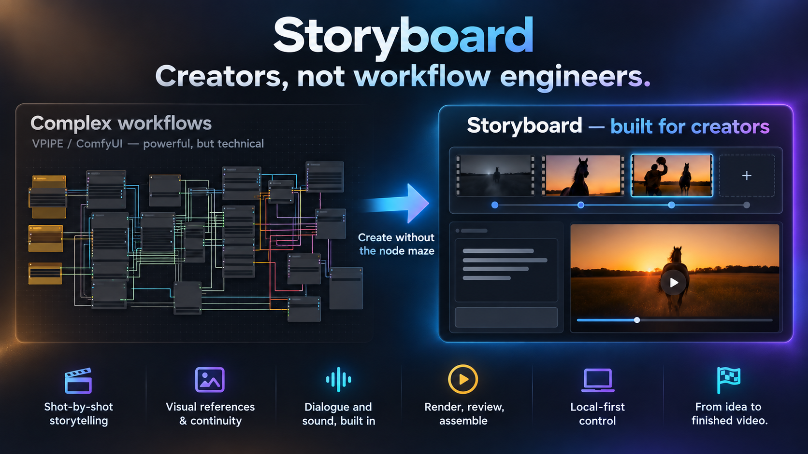

# Storyboard



Storyboard is for creators who want to direct a sequence of shots without
having to build or debug a VPIPE or ComfyUI node workflow.

### Why Storyboard?

- **Shot-by-shot storytelling** — plan, reorder, and refine a complete piece.
- **Visual references and continuity** — keep characters, environments, and
  compositions coherent across shots.
- **Dialogue and sound built in** — manage spoken lines, voice generation, and
  sound cues alongside the picture.
- **Render, review, and assemble** — see what worked, understand what failed,
  and join the finished shots into a video.
- **Local-first control** — use your own Apple Silicon hardware, models, and
  services without hiding the pipeline behind a black box.

A storyboard-shaped front end for local video generation. Build a piece as an
ordered sequence of shots — each with a prompt, optional reference frames, a
cast and a length — and the tool compiles each shot into a real pipeline, runs
them one at a time, and tells you honestly whether each one worked.

Currently drives [vpipe](https://github.com/tgo-app-dev/vpipe) (MiniMax H3 for
video, Krea-2 Turbo for stills) on Apple Silicon. ComfyUI is a documented
scaffold behind the same interface.

Design rationale and the orchestrator contract:
[`docs/STORYBOARD-UI-DESIGN.md`](docs/STORYBOARD-UI-DESIGN.md).

## Installation

The web app itself has no Python package install step and no Node build step:
it runs on Python's standard library. The full workflow does need system tools
and model services.

### 1. Install system dependencies

macOS/Homebrew:

```sh
brew install python@3.14 ffmpeg lsof
```

Minimum versions:

| Dependency | Required for | Notes |
| --- | --- | --- |
| Python 3.10+ | The storyboard web server | `start.sh` prefers Homebrew Python 3.14, 3.13, 3.12, 3.11, then 3.10. |
| vpipe CLI | Rendering MiniMax H3 / Ref2VA / Krea-2 pipelines | Pass with `--vpipe PATH` or set `SBV_VPIPE`. |
| vpipe workspace with `models/` | Model discovery and render runtime | Pass with `--workspace DIR` or set `SBV_WORKSPACE`. |
| ffmpeg | Final video assembly and dialogue muxing | Without it, individual renders can still run, but final joining/dubbing is limited. |
| lsof | `./start.sh --restart` | Used to find the process listening on the selected port. |
| Ollama or OpenAI-compatible LLM service | Prompt rewrite and character-description AI buttons | Optional; configured in `llm-services.json`. |
| TTS service or MOSS models | Spoken dialogue | Optional; configured in `tts-services.json`. |
| Node.js | Browser/JS regression tests only | Not needed to run the app. |

There is deliberately no `pip install -r requirements.txt` and no
`npm install`.

### 2. Install or point to vpipe

Build or install vpipe separately, then make sure the storyboard app can find
the CLI binary and the workspace where vpipe keeps its `models/` directory.
Pass those paths explicitly if your checkout is not in the default location:

```sh
./start.sh --workspace /path/to/vpipe-workspace \
  --vpipe /path/to/vpipe/build/apps/vpipe/vpipe
```

Use flags or environment variables if your paths differ:

```sh
export SBV_WORKSPACE=/path/to/vpipe-workspace
export SBV_VPIPE=/path/to/vpipe/build/apps/vpipe/vpipe
```

The workspace is vpipe's runtime root. It is where vpipe resolves `models/`
and its model registry from, so it must be the same workspace used when the
models were prepared.

### 3. Prepare vpipe models

Run the setup pipelines from the vpipe workspace for the models you want to
use:

```sh
cd "$SBV_WORKSPACE"
"$SBV_VPIPE" --launch setup/prepare-minimax-h3-8bit.vpipeline
"$SBV_VPIPE" --launch setup/prepare-minimax-h3-ref2va-8bit.vpipeline
"$SBV_VPIPE" --launch setup/prepare-krea-2.vpipeline
```

Those are the render models currently exposed by the UI:

| Model | UI mode |
| --- | --- |
| MiniMax H3 8-bit | Text-to-video with generated sound |
| MiniMax H3 Ref2VA 8-bit | Reference images / voice clips to video |
| Krea-2 Turbo | Still-image prompt preview |

If your vpipe workspace keeps setup files elsewhere, run the equivalent
prepare pipelines from that workspace. The server startup banner reports which
models are available.

### 4. Configure storyboard storage

Storyboards and uploads are saved under:

```text
<data-dir>/projects/<board-slug>/
```

By default, `--data-dir` is a fixed path baked in at
`DEFAULT_DATA_DIR` in `server/__main__.py` — this checkout's own machine, not
yours, so treat it as a placeholder to override rather than a sensible
default. The intent is a directory outside any vpipe workspace, so
storyboards are never left inside a runtime/sandbox folder. Point it at your
own location:

```sh
export SBV_DATA_DIR=/path/to/storyboard-data
```

or from the app itself: **⚙ Settings → Global projects folder**, which saves
the path to `server-config.json` (next to `llm-services.json`) and restarts
the server onto it — no flag or environment variable needed. Priority, highest
first: `--data-dir` flag, `SBV_DATA_DIR`, `server-config.json`, then that
baked-in default — so a launch script that already pins one of the first two
keeps working untouched, and Settings tells you so if it would otherwise be
overridden.

### 5. Fetch speech models, if using local MOSS

`vpipe-moss` needs two models in the workspace. Once:

```sh
cd "$SBV_WORKSPACE"
"$SBV_VPIPE" --launch setup/prepare-moss-tts.vpipeline
```

That pulls `mlx-community/MOSS-TTS-8B-8bit` (already 8-bit, no quantize pass)
and `OpenMOSS-Team/MOSS-Audio-Tokenizer`. The engine reports itself
unavailable until both are present, and treats a directory containing
`*.part` as still downloading.

**Two directories, on purpose.**

`--workspace` is vpipe's. It resolves `models/` and its LMDB model registry
relative to the directory it is launched from, so this must be the directory
the models were prepared in — it is not ours to choose.

`--data-dir` is yours: storyboards and uploaded references. It **defaults to
whatever `DEFAULT_DATA_DIR` in `server/__main__.py` says** (so projects land
in `<that path>/projects/`), but it can be anywhere, which is the point — a
storyboard and its reference images are documents, and should not have to
live inside another tool's runtime directory to be usable. Set `--data-dir`,
`SBV_DATA_DIR`, or Settings → Global projects folder to your own path; don't
rely on the shipped default.
Nothing is moved automatically when you point it somewhere new; the startup
banner names any boards left behind in the old location and prints the `mv` to
move them, because they are your files.

Paths stored in a board stay relative to the data directory, which is what
keeps a project folder portable. Paths written *into* a generated pipeline are
absolute, since the data directory need not sit under the workspace vpipe runs
in. (Verified: vpipe reads and writes outside its workspace, because the file
sandbox in `common/session.cc` is opt-in via a `file_sandbox` config key that
these pipelines do not set.)

The startup banner lists both directories and which models, speech engines and
rewrite models it can actually see.

### 6. Configure optional services

The first run creates service config files if they do not exist:

```text
tts-services.json
llm-services.json
```

Edit `tts-services.json` for speech engines such as local MOSS through vpipe,
a Qwen-style voice-clone service, or a plain HTTP TTS service. Edit
`llm-services.json` for prompt rewriting and image-based character
description services such as Ollama or an OpenAI-compatible
`/v1/chat/completions` server.

For services needing an API key, use `apiKeyEnv` in the config and keep the
secret in the named environment variable.

## Running it

```sh
./start.sh                              # http://localhost:9877
./start.sh --lan                        # reachable on your LAN
./start.sh --port 8080
./start.sh --workspace DIR              # where vpipe is launched from
./start.sh --data-dir DIR               # where your storyboards live
./start.sh --vpipe PATH                 # path to the vpipe CLI binary
./start.sh --tts qwen3-clone            # default engine id (see tts-services.json)
./start.sh --llm ollama-local           # default rewrite model (see llm-services.json)
```

Run in the foreground while developing; Ctrl-C stops it.

```sh
./start.sh
```

Run or restart detached on the same port:

```sh
./start.sh --restart
./start.sh --restart --port 9877
```

Detached mode writes:

```text
server.log
server.pid
```

Port 9877 is the default so it does not collide with `vpipe-web-ui` on 9876.
`serve.sh` is still present as the older foreground-only launcher, but
`start.sh` is the recommended entry point.

## Settings reference

Every machine-specific location or service this app talks to is configurable
from outside the code — nothing here should ever need editing in a `.py` or
`.js` file. Three places to set it, later ones winning over earlier ones:

1. A baked-in default — always something harmless (`127.0.0.1`, or a path
   under this checkout), never a real personal host.
2. A config file — `server-config.json`, `tts-services.json`,
   `llm-services.json`. Editable by hand or, for the data directory, from
   **⚙ Settings** in the app itself.
3. An environment variable, or the matching CLI flag (flags win outright).

| What | Flag | Env var | Config file |
| --- | --- | --- | --- |
| Port | `--port` | `SBV_PORT` | — |
| Bind address | `--bind` / `--lan` | `SBV_BIND` | — |
| Render backend | `--backend` | `SBV_BACKEND` | — |
| vpipe workspace | `--workspace` | `SBV_WORKSPACE` | — |
| vpipe CLI path | `--vpipe` | `SBV_VPIPE` | — |
| Storyboard data dir | `--data-dir` | `SBV_DATA_DIR` | `server-config.json` |
| ComfyUI URL | `--comfyui-url` | `SBV_COMFYUI` | — |
| Default TTS engine id | `--tts` | `SBV_TTS` | `tts-services.json` |
| Default LLM/rewrite id | `--llm` | `SBV_LLM` | `llm-services.json` |
| TTS/LLM service URLs, API keys | — | — | `tts-services.json`, `llm-services.json` — use `apiKeyEnv` in either to name an environment variable rather than checking a key in |

`tts-services.json` and `llm-services.json` are tracked in git, so whatever
they contain ships with the repo — the versions here use `127.0.0.1`
placeholders on purpose. Point them at your own services after cloning
rather than committing a real hostname or IP back into them.
`server-config.json` is created by the app and gitignored, so your data-dir
choice never gets committed at all.

## Where things live

```
<workspace>/projects/<board-slug>/
├── storyboard.json      the whole board: scene, sound, cast, shots
├── final.mp4            every shot, joined in order
├── refs/                reference images and voice clips (uploads and picks)
└── shots/01/
    ├── shot.vpipeline   generated per render
    ├── clip.mp4         the render
    ├── clip-dubbed.mp4  with synthesised dialogue mixed in
    ├── dialogue.wav
    ├── run.log          stdout, exit code and timing
    └── frames/*.png
```

A project folder is self-contained: copy or zip it and you have the board, its
references and everything it rendered. Picked images are copied in rather than
referenced in place, so a board never depends on an outside folder.
Save, load and export are all the same file.

## What it does

**Two-tier prompting.** A project-level scene description (subject and style,
true of every shot) plus a per-shot prompt (action, camera, mood). The editor
shows the assembled result, so nothing about the composition is hidden.

**Style references and the media library.** Style reference images are
project-wide and are sent to vpipe's `video-ref-encoder` with each shot's own
references and selected Cast media. Every Storyboard video shot uses Ref2VA,
so start/end references, subject/style images, portraits and the speaker's
voice reference can travel in one request. The model's nine-image/three-audio
limits are enforced before rendering.

The image picker scans project `refs/` folders and rendered stills, groups
exact duplicate images by content hash, and shows where used files are
referenced: scene start/end frames, scene character refs, cast refs, or global
style refs. Used images are faded and protected from deletion. Unused images,
including unused duplicate copies, show a trash button.

**Sound in two layers.** A project-wide background bed and per-shot accents.
The background bed can be rendered into every shot for quick all-in-one clips,
or held out of shot renders so music/ambience can be added later as one
continuous final mix. Per-shot accents still render with each clip: local
effects like switches, impacts, footsteps or spray. Sound cues are appended
after the visual description because MiniMax H3 generates its soundtrack in the
same denoise loop as the picture and its own examples put sound in a trailing
clause. Dropped automatically for a still.

**A cast.** Characters have a required name and description, and optional
reference image and voice clip. An attached clip shows its name behind a ♪ and
a player, so it can be heard without leaving the dialog — and both slots pick
from what is already in your projects as well as offering an upload. Audio used
to jump straight to a file dialog, which meant a clip already uploaded into a
project's `refs/` could never be attached to anyone: you could only upload it a
second time. A shot casts whoever appears in it and refers
to them by name in its prompt. On Ref2VA the portrait becomes an image
reference and the voice clip a soundtrack reference, respecting that model's
real limits (9 images, 3 soundtracks, 12 total).

**Start/end references and chaining.** Storyboard video shots always use
Ref2VA. The Start frame and End frame controls identify the intended opening
and closing compositions and are sent first in the ordered Ref2VA reference
list, followed by other shot, Cast and project references. They are semantic
visual cues rather than FL2VA-style hard-pinned keyframes. “Chain start frame
from the previous shot” still resolves the previous shot's last saved frame
into that Start frame reference.

**Transcription is its own capability.** Cloning a voice and recognising
speech are separate, and one does not imply the other — MOSS clones a voice and
has no speech recognition at all. So engines declare `supports_transcription`,
the Transcribe button reports on whichever configured service actually has it
(naming it in the tooltip), and `/api/transcribe` uses the engine you asked for
when it can and otherwise finds one that can, saying which it used.

**Dialogue, in the character's own voice.** **Generate** synthesises the shot's
line using the speaking character's reference clip and transcript, so what you
hear is their cloned voice, not a generic one. Who speaks is inferred when a
shot has one character in it and chosen from a list when it has several,
preferring whoever actually has a clip.

The Dialogue tab also has **Voice direction** for delivery notes such as
`tired`, `quiet`, `breathy`, `urgent whisper`, or `slight smile`. Those notes
are sent separately to compatible speech engines and are not spoken aloud. If
the direction changes after a take was generated, the app treats the existing
spoken audio as stale and asks you to speak the line again.

For `qwen3-clone`, the adapter sends the shot dialogue as the text to speak
and sends voice direction through Qwen's instruction field. You can paste a
full Qwen-style block in **Voice direction**; the app keeps the delivery
section and ignores the `[TEXT TO SPEAK]` section because the shot dialogue is
already the source of truth:

```text
[STYLE / VOICE DIRECTION]

...

[TEXT TO SPEAK]

...

[END]
```

It works **before the shot is rendered**. Synthesis and muxing are separate
functions for that reason: finding out after half an hour of video that a
cloned voice reads the line wrong is exactly the wrong order. You get a player
next to the line immediately. The line also reaches the video render as a
visual cue — "speaks the line with natural jaw and lip movement" — so the shot
prompt can stay about action and framing instead of carrying spoken words.
When the clip exists, the TTS speech is mixed over it while the generated audio
is explicitly asked to stay ambient only: no spoken words, no voice and no
intelligible dialogue.

Dubbing separately from rendering is deliberate in the other direction too: a
line can be rewritten and re-spoken in seconds without touching a clip that
took half an hour, and nothing in H3's documentation claims intelligible
phoneme-accurate lip-synced speech from written text.

**Every take is trimmed and levelled.** Both of these are model behaviour, not
integration bugs, and both were measured here rather than assumed. MOSS 8B does
not stop when it has finished a line — it emits silent frames until it runs out
of token budget, and one take arrived 79.4 seconds long with the speech ending
at 5.2s. The same take peaked at −23 dBFS, far too quiet to sit under a
generated soundtrack. So silence is trimmed off *both ends* (never from the
middle — those are the pauses between words, and removing them makes the
delivery unnatural) and the result is normalised to −16 LUFS with a −1.5 dB
true-peak ceiling. That happens in `speak_line`, so no engine added later can
quietly skip it. MOSS also gets a text-proportional token budget, which stops
it spending most of its runtime generating nothing.

**The engine says what it did.** A cloned voice that comes back wrong is nearly
always the reference clip or its transcript, and neither is visible from a
waveform. So each take writes a `speech.log` beside the audio — the reference
used, the transcript (and whether it had to be derived), the text, the
response, what was trimmed, what the level was set to — and it appears in the
same **Backend output** window as the render, after it, under its own header.
One window because they are both "what the machine did on this shot"; separate
containers inside it so each can be filled independently and the render poll's
append only ever touches its own lines.

**Open, not import.** The header's **Open** lists every storyboard on disk
with what each folder actually holds — shot count, how many are rendered, and
the full path to its `storyboard.json` — and opening one edits that file in
place. This replaces an Import button that was the wrong verb: picking your own
board's `storyboard.json` made a *second* project from it, carrying the shot
list but none of the renders, with its references still pointing back into the
original folder. Copying a board in from elsewhere is still available in that
dialog, and now says what it does — a browser hands over a file's contents, not
its location, so it cannot open one in place.

The rendered count is on every row because two projects can carry the same
name, and telling them apart is exactly what you need at that moment.

**Renaming a project.** A project's name and its folder move together. The
folder name is the slug, and the slug is baked into every path the board has
recorded — thumbnails, run logs, outputs, cast portraits — so renaming the
display name alone would leave the folder saying something else, and moving the
folder alone would break all of those. Rename does both and rewrites the paths,
walking the whole board rather than the fields it happens to know about. It
refuses while a render is running, since the orchestrator is holding those
paths.

**Prompt rewriting.** A good MiniMax H3 prompt has a shape — camera move named
first, subject and action, environment and light with concrete material detail,
then the sound in one trailing clause. The 🪄 button on a shot prompt hands
your words to a local language model that knows that shape and asks for a
restyle. The result is shown as a **proposal with Use this / Discard** — never
applied on the model's word, because the prompt is your authorship and took
thought to write. The scene description and the shot's cast go along as
context marked *do not repeat*, since both are already prepended when the full
prompt is assembled. The shot's attached reference photos are also sent to
vision-capable rewrite services, so the rewrite can use their actual visual
constraints without describing attached character identities in prose.

The same 🪄 button rewrites three other fields, each with its own house
style so the model does not blur what belongs where: the project's **scene
description** (surroundings and visual style only — characters have their
own separate description, so it is never asked to describe one), the
project's **background sound** (grounded in the scene description, proposing
concrete effects suited to that setting rather than a vague mood), and a
shot's own **sound accents** (grounded in that shot's own prompt — the
action, environment and materials in it — and explicitly never dialogue).
The character **AI** button sends the portrait, attached voice clip (when
present), and starting description to a multimodal service and asks only for a
character description, never a scene description.

**Dialogue, cloned twice over — once for real.** On a Ref2VA shot, the
speaking character's own voice clip is already sent in as a soundtrack
reference (see "A cast" below), and verified to be enough on its own for H3
to speak a line correctly. So there, the shot is asked to speak the line
aloud in that voice directly, and the Dialogue tab shows a note instead of
the dub controls — a separate TTS take would be a second, independently
synthesised copy of the same line, which is exactly the doubled-voice bug
this replaced. FL2VA has no mechanism to tell H3 what anyone sounds like, so
dialogue there stays a silent lip-movement cue for TTS to dub in afterwards,
same as before.

**Tabbed prompt editing.** Shot prompt, dialogue, sound accents and the
resolved prompt share one tall pane rather than stacking four short boxes.
Each tab carries a dot when its field has content, so tabbing away never hides
the fact that a shot has dialogue. The resolved tab shows the assembled prompt
**segmented and labelled by source** — scene, each cast member, shot, sound
bed, accents — so it is never ambiguous which clause came from where.

**Draft mode.** Renders with the long edge capped around 384 px and 4 steps,
without generated audio or full PNG frame dumps unless another shot chains
from it. Clip length and seed are left alone, so the move you see is the move
you will get. A draft output is badged as such so it is never mistaken for a
finished shot.

**Aspect ratios.** 21:9, 16:9, 4:3, 1:1, 3:4 and 9:16, every dimension a
multiple of 32 so H3 does not silently round the request. The picker includes
large experimental outputs such as 1536x864 and 1920x1088; sizes a model's own
documentation cites are marked, anything else is offered but labelled untested.

## Selectable engines

Render backends (`server/backends/`) and speech engines (`server/tts/`) are
both pluggable, and each reports its own health so a missing model or an
unreachable service says so at startup rather than mid-render.

Speech services are **linked, not installed**. A voice model may be running as
a separate service, so this app points at it by name and URL in
`tts-services.json` (created on first run, meant to be edited):

```json
{"services": [
  {"id": "qwen3-clone", "label": "Qwen3-TTS voice clone",
   "kind": "qwen3-clone", "url": "http://127.0.0.1:8790"}
]}
```

Adding another instance is an entry, not a code change. `kind` picks the
client:

| kind | Notes |
| --- | --- |
| `vpipe-moss` | MOSS-TTS 8B through vpipe's own text-to-speech stage. Local, no URL needed, and clones a voice from a reference clip. Needs the MOSS models fetched — run `setup/prepare-moss-tts.vpipeline` from the workspace (~9 GB, one time). Roughly 27s for a short line on an M4 Pro. |
| `qwen3-clone` | A Qwen3-TTS-compatible voice-clone HTTP service. The transcript conditions the clone, so it needs a reference clip **and a transcript of what it says**; if the service exposes transcription, the app can fill that transcript from the clip. |
| `none` | Dialogue is stored but not spoken. |

Language models for prompt rewriting work the same way, in
`llm-services.json`:

```json
{"services": [
  {"id": "ollama-local", "label": "Ollama",
   "kind": "ollama", "url": "http://localhost:11434",
   "model": "qwen3.8:27b-mlx"}
]}
```

`kind` is `ollama` (native `/api/chat`) or `openai` (anything serving
`/v1/chat/completions` — llama.cpp, vLLM, LM Studio). Health checks that the
**configured model is actually pulled**, not merely that the port answers. A
27B local model takes roughly a minute per rewrite, which is why the button
shows progress and the result waits for approval. For a service needing a key,
use `apiKeyEnv` to name an environment variable rather than putting the key in
this tracked file.

## MCP: driving Storyboard from an AI assistant

`mcp/server.py` is an [MCP](https://modelcontextprotocol.io) server that
exposes every storyboard feature the web UI has — boards, shots, references,
dubbing, rendering, settings — as tools an AI assistant (Claude Desktop,
Claude Code, or any other MCP client) can call directly. It is a thin bridge
to the same JSON API the browser uses (`server/app.py`); it has no logic of
its own, so a board edited by an assistant is edited exactly the way the UI
would edit it. Standard library only, same as the rest of this app — nothing
to `pip install`.

**Setup.** Point your MCP client at the script:

```json
{
  "mcpServers": {
    "storyboard": {
      "command": "python3",
      "args": ["/absolute/path/to/storyboard/mcp/server.py"]
    }
  }
}
```

For Claude Code: `claude mcp add storyboard python3 /absolute/path/to/storyboard/mcp/server.py`.

**It starts the app for you.** The MCP server doesn't run the storyboard app
itself — it talks to it over HTTP at `http://127.0.0.1:9877`. But the first
time a tool is called, it checks whether that server is already up and, if
not, launches `start.sh` and waits for it, so simply having the MCP server
configured is enough: you don't need to `./start.sh` first. Set `SBV_PORT` if
you run the app on a non-default port, or `SBV_MCP_URL` to point at a host
other than localhost.

**What it can do.** One tool per API endpoint — the same list in
`server/app.py`'s own routing table:

| Tool | Same as the UI's... |
| --- | --- |
| `sbv_info` | startup banner — backend health, available models, speech/rewrite services |
| `sbv_list_boards` | the **Open** dialog |
| `sbv_get_board` / `sbv_save_board` | loading a board / every autosave while editing |
| `sbv_create_board` / `sbv_import_board` | **New** / **Copy a board in** |
| `sbv_delete_board` | deleting a project |
| `sbv_rename_board` | renaming a project (moves its folder, rewrites its paths) |
| `sbv_export_board` | downloading a board as JSON |
| `sbv_add_shot` | **+ Shot** |
| `sbv_upload_ref` / `sbv_adopt_ref` | uploading or picking a reference image or voice clip |
| `sbv_list_library` / `sbv_delete_library_item` | the image/voice picker grid and its trash button |
| `sbv_transcribe` | **Transcribe** on a reference clip |
| `sbv_dub_shot` | **Generate** on the Dialogue tab |
| `sbv_accept_take` | **Keep this take** |
| `sbv_rewrite_prompt` | the 🪄 prompt rewrite button |
| `sbv_describe_character` | drafting a character description from their portrait |
| `sbv_start_render` / `sbv_stop_render` / `sbv_status` | **Render** / **Stop** / the live progress rail |
| `sbv_assemble` | joining rendered clips into `final.mp4` on demand |
| `sbv_set_data_dir` / `sbv_restart_server` | **⚙ Settings → Global projects folder** |

Since a board is a single JSON document, most edits — the scene description,
sound, cast, per-shot prompt/dialogue/model/reference fields — go through
`sbv_get_board` → edit the object → `sbv_save_board`, exactly as the browser's
own autosave does; the other tools are the actions the UI has as their own
buttons (render, dub, rename, transcribe, and so on).

**Example prompts**, once the tool is connected:

- "List my storyboards and tell me which ones have unrendered shots."
- "Open the 'Mustang' board, rewrite shot 2's prompt, and start rendering it."
- "Add a new shot to `lara-croft-the-hunt` with this prompt: ..."
- "Transcribe `refs/villain.wav` in the Mustang board, then generate the
  dialogue for shot 3 using it."

## Tests

```sh
python3 tests/store_paths.py             # renaming, and an independent data dir
python3 tests/speak_line.py              # who speaks, and previewing without a render
python3 tests/render_all.py              # what "Render all" picks up, and the final cut
node tests/edits-persist.mjs             # every edit reaches the server, not just the first
node tests/poll-does-not-rebuild.mjs     # the poll must not rebuild a focused subtree
```

The two `.mjs` ones drive the real page over the DevTools protocol; each file's
header has the two commands to start the server and a debug Chrome, and both
take `CDP_PORT` (9222 by default).

All of them cover one class of bug: something is replaced underneath state that
had already recorded where it was. Renaming rewrites the paths a board
recorded. The poll must not rebuild a subtree holding a focused input. And
saving must not replace the object graph the editor's handlers point into —
each was a silent failure, which is why they are pinned rather than
remembered.

## Why a run is judged, not just started

Every failure encountered while driving vpipe by hand **exited with code 0**.
It warns and continues rather than crashing, which is right for an interactive
tool and dangerous for an unattended queue. So a shot counts as done only if
it exited clean **and** produced every file it declared **and** took a
plausible amount of time **and** showed evidence the denoise loop ran. A run
that produced its outputs but tripped a softer signal is flagged for review
rather than discarded, and a shot chained to a failed shot is blocked rather
than rendered against a missing frame.

The runtime baseline is fitted to measured runs on an M4 Pro: 124 frames in
27m44s, 39 frames in 7m32s, denoise growing as roughly `frames^1.37`. It has
predicted subsequent runs within 5%.

## Why "Render all" re-renders a shot that says done

A shot already marked done is skipped, because a re-render costs between six
and forty minutes and doing it casually is worse than not doing it. But "done"
has to mean *done from what the board says now*, and for a while it only meant
"done, once". A full run over a three-shot board rendered one shot, kept two
clips of prompts that had since been rewritten, reported success, and gave no
hint that two thirds of the batch had been skipped.

So every render records a fingerprint of its inputs — the shot prompt and
dialogue line, sound note, the scene description and background bed, the cast
it uses and their descriptions and portraits, the reference images, the model,
frame size, frame count, steps, seed and draft mode. A whole-board run picks up
any shot whose fingerprint has moved, plus anything chained to one of those,
since a start anchor taken from a re-rendered shot is a different picture.
Dialogue is included because it is passed to the video model as a visual cue
for natural jaw and lip movement; the spoken audio is still synthesised outside
the render and mixed over the finished clip.

A shot rendered before any of this existed has no fingerprint, and is treated
as stale — it may well be current, but nothing can show that it is, and
assuming otherwise is how the wrong clip reaches the cut. **Keep this take**
on the shot records it as current without re-rendering, for when you know it
is. The board header says how many shots a run will take before you press it.

## Why there is a concat pass at all

A board of finished clips is not the deliverable. The last step used to be
manual and undocumented, so a run could render every shot and still leave you
with a folder. `server/assemble.py` joins them in board order into
`final.mp4` at the end of a whole-board run, or on demand from the rail.

It re-encodes rather than stream-copying, because the inputs genuinely are not
uniform: a dubbed clip carries AAC, an undubbed one whatever the model wrote,
and a still has no audio track at all — and `concat` with `-c copy` over
mismatched streams yields a file that plays for the length of the first clip.
A clip with no audio gets a matched stretch of silence so nothing after it
drifts. A shot with no render is left out and *named*, and the cut is marked
partial rather than quietly being short.

`clip-dubbed.mp4` is preferred over `clip.mp4` only while it is newer, since
it is built from the clip and a re-render leaves it describing a video that no
longer exists. A line that was spoken before its shot was rendered is now laid
onto the clip when that render finishes; one that was spoken before this
existed is reported in the rail rather than silently missing from the cut.

## Why the poll paints instead of re-rendering

While a render is in flight the queue is polled once a second. That tick
changes percentages and a phase label, almost never the shape of the page — so
it updates those in place and rebuilds nothing. Rebuilding was the original
approach and it cost two visible bugs at once: every image re-decoded and any
playing `<video>` reloaded (a flicker on the second), and the field you were
typing in was destroyed and recreated, so editing one shot while another
rendered dropped the caret every second. A full rebuild now happens only when
something structural moves — a status transition, a new thumbnail, a new
output — and carries the caret across when it does.
`tests/poll-does-not-rebuild.mjs` asserts all of it against the running page.

## Known gaps

- The ComfyUI backend is a scaffold with an integration plan, not an
  implementation.
- Board editing is a whole-board save, so two browser tabs on one board are
  last-write-wins. The render queue writes the board too, so an edit made
  during a long shot can be overwritten when that shot finishes.
- The cut is a straight concatenation: no transitions, no per-shot trimming,
  and no separate audio bed across the whole piece.
- `library()` (the pick-an-existing-image grid) scans the data directory only.
  Images sitting elsewhere in the vpipe workspace are not offered; upload them
  or copy them into a project folder.

## License

[CC BY-NC-SA 4.0](https://creativecommons.org/licenses/by-nc-sa/4.0/) — see
[`LICENSE`](LICENSE). Use it, modify it, contribute back — but not for
commercial purposes, and not relabelled as someone else's own work.

## Author

Peter Chodyra — [candco.com.au](https://candco.com.au)
