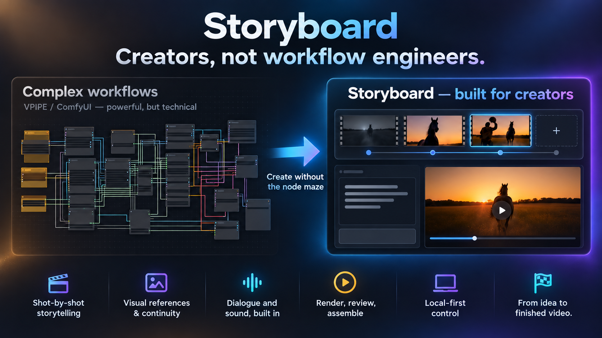

# Storyboard

**Storyboard runs on [vpipe](https://github.com/tgo-app-dev/vpipe)** by T-Go LLC,
the engine that runs AI video models on Apple Silicon Macs. Storyboard is the
creative layer on top: you plan a film shot by shot, and vpipe renders each
shot with **MiniMax H3**, a video model that makes picture and sound together.



Storyboard is for creators who want to direct a sequence of shots without
building or debugging a node workflow. New here? The
[User guide](docs/USER-GUIDE.md) walks through it with screenshots.

## Key features

**Plan**

- **Shot-by-shot storytelling** — a storyboard strip of shots you can add,
  reorder, rename and lock. Write what stays the same once (scene, look,
  background sound); each shot only describes what happens.
- **Prompt guide** — click the logo for framing, camera-movement and dialogue
  wording you can copy straight into a shot, with diagrams.
- **Saved prompt versions** — keep and rate versions of a shot prompt, and go
  back to one that worked.

**Characters, voice and sound**

- **Characters that stay the same** — a portrait and a description keep a
  character looking the same in every shot.
- **Cloned voices and dialogue** — attach a voice clip to a character, hear a
  line before you render the video, and direct the delivery ("tired, quiet").
  Or let H3 speak the line itself, lip-synced.
- **Layered sound** — background ambience, per-shot sound accents, and a
  soundtrack under the finished video that ducks under dialogue.

**Refine with AI**

- **Rewrite** — turn rough words into a clear prompt for the scene, a shot,
  sound, dialogue or a character. You see a proposal and choose **Use this** or
  **Discard**; nothing is replaced behind your back.
- **Storyboard AD** — a chat assistant that knows your whole board. It reviews
  continuity and proposes edits you can apply or discard.
- **`/refine`** — the AD renders a draft, checks it against a checklist
  (green ticks and red crosses show what passed), rewrites the prompt where it
  fell short, and tries again.

**Render and finish**

- **Draft mode and seed comparison** — fast rough renders to test an idea, and
  the same shot at several seeds to tell a prompt problem from a bad roll.
- **Continuity** — start a shot from the last frame of the one before it, or
  guide it with start/end frames, reference images and style references.
- **Render, review, assemble** — see what worked and why something failed,
  render one shot, all shots, or several projects overnight, then join the
  shots into one video with trims and fades.
- **Drive it from an AI assistant** — a built-in MCP server lets Claude and
  other assistants use every feature.
- **Fully local, or cloud for the AI helper** — video, voices, music and
  images always run on your Mac. For Rewrite, the Storyboard AD and `/refine`
  you choose: a local model (Ollama, LM Studio and others) or a cloud one
  (Claude, OpenAI, Gemini and more). [Details below.](#run-fully-local-or-use-the-cloud)
- **Your files stay yours** — projects live in a folder on your Mac. Nothing is
  uploaded unless you pick a cloud AI helper (see below).

## Key features in detail

### Run fully local, or use the cloud

Storyboard has two kinds of AI. The first makes your film: video, speech,
music and pictures. That **always runs on your Mac**. The second is the
*language-model helper* behind **Rewrite**, the **Storyboard AD** and
`/refine`. You choose where that one runs, per project, under
**Settings → General → Prompt rewriting**. Add as many services as you like and
switch between them with one click.

**Language model helper (Rewrite, Storyboard AD, `/refine`)**

| Where it runs | Platforms |
| --- | --- |
| **Fully local, on your Mac** | [Ollama](https://ollama.com), [LM Studio](https://lmstudio.ai), and any server that speaks the OpenAI chat API, such as llama.cpp, vLLM and oMLX (MLX models work well) |
| **Another machine on your network** | The same servers, pointed at a URL such as `http://mac-mini.local:8000` |
| **Cloud** | [Anthropic Claude](https://www.anthropic.com), [OpenAI](https://platform.openai.com), [Google Gemini](https://ai.google.dev), [OpenRouter](https://openrouter.ai), [Groq](https://groq.com), [Mistral](https://mistral.ai) |

- **Fully local means nothing leaves your Mac.** Choose a local model, or
  *None* to switch the AI helper off. The video, voice, music and image tools
  need no internet once they are installed.
- **With a cloud service, the text it works on is sent to that provider**: your
  scene, cast and shot prompts, and the board the AD is reviewing. If the model
  can see, pictures are sent too: a shot's reference images, character
  portraits and style references, plus stills from draft clips during
  `/refine`. Your finished videos are not sent. A character's voice clip is sent
  only when you ask the AI to describe that character. Choose a cloud service
  only for work you are happy to share with it.
- **Setting one up** is a few fields: pick the service type, the model name and,
  for cloud, your API key. The key is stored on your Mac, or read from an
  environment variable if you prefer. Storyboard checks the service is online
  and that the model exists, and tells you if not.
- **Pick a model that can see** if you want `/refine`, because it reviews
  pictures. Most current Claude, OpenAI and Gemini models can, and so can some
  local models. Check that the one you choose accepts images, or `/refine` will
  report that the review was unreadable.

**Everything else is local, by design**

| Job | Runs locally with |
| --- | --- |
| **Video and picture-with-sound** | MiniMax H3, through [vpipe](https://github.com/tgo-app-dev/vpipe) or [h3.c](https://github.com/antirez/h3.c) (Apple silicon, Metal). Wan 2.2 and LTX-2.5 are optional, experimental engines through vpipe |
| **Cloned voices** | MOSS-TTS 8B (through vpipe) or Qwen3-TTS. A plain sherpa-onnx voice is available without cloning. Speech engines are *linked by URL*, so one can also run on another machine on your network |
| **Soundtrack music** | Stable Audio 3 (MLX), or your own audio file |
| **Create Image** | Krea-2 Turbo (through vpipe or mflux) or Z-Image Turbo (mflux) |
| **Web research for the AD** (optional) | Any SearXNG-style search engine you run, at a URL you give it |

### `/refine`: fix a shot without the trial and error

AI video is hit and miss. A shot is often *almost* right: an actor on the wrong
side, a camera that doesn't move, a window that should not be there. The usual
fix is to edit the prompt, wait half an hour, look, and repeat. `/refine` does
that loop for you, on cheap drafts, and tells you exactly what it found.

You describe the problem in your own words, in the AD chat:

> `/refine scene 9 there should be no windows in front of the desk, like in
> scene 7, and Spectral Elias should only fall asleep once he is out of view.
> Up to 5 attempts.`

Then Storyboard:

1. **Turns your words into a checklist** of up to eight yes/no things a single
   frame can show, and marks the **critical** ones: what you stressed, and what
   the shot is wrong without. You can edit the list and the number of attempts
   before it starts, and start any line with `!` to make it critical. The same
   list judges every attempt, so attempt 3 is comparable with attempt 1.
2. **Renders a quick draft** of the shot. Your real clip is never overwritten.
3. **Reviews stills from the draft** (about one a second) alongside the
   character portraits, and marks each check **✓ met** or **✗ not met**, with
   the reason. The score is the share of checks met, counted by the app, not a
   number the model makes up.
4. **Rewrites the prompt for the checks that failed**, remembering what earlier
   attempts already tried, and goes round again, up to your attempt limit.

**Critical checks decide when it stops.** A clip that scores 92% but misses a
critical check is *not* a pass: the loop keeps going until every critical check
is met, however well the rest do. If the model has nothing new to change it is
asked again more firmly, and if the words still can't move, the same prompt is
tried on a new seed. It also stops when the attempts run out or you press
**Stop**. Your board is not edited. At the end you get the
best-scoring prompt as a card to apply or discard, plus every attempt's draft
clip and prompt to compare. After applying, render the shot for real.

**Why it helps:** you decide *what* is wrong and the machine does the repetitive
trying, using cheap drafts instead of full renders. The ticks and crosses show
what each attempt fixed, so you can see progress, not just wait. It needs an
AD model that can look at pictures, and a pass is a strong hint, not a
guarantee, so watch the clip.

### Troubleshooting with Compare seeds

Every render starts from a random "seed". When a shot looks wrong you can't
tell whether your *prompt* is the problem or you just had a bad roll of the
dice. **Compare seeds** answers that. It renders the same shot several times,
changing only the seed, and shows the takes side by side so you can play them
together.

- **Most takes share the problem:** the prompt is at fault. Fix the words.
- **Only some takes have it:** it was the dice. Pick a good take.

Takes are kept beside the shot. The shot's own clip is only replaced when you
pick one. Each take costs about as long as a normal render, so use it on shots
that matter. **Delete takes** frees the disk space afterwards.

### Storyboard sketches: one image, in pencil

**Create Image** makes a single picture of a shot's opening frame, from its
prompt plus the scene and cast descriptions. It is a cheap way to check
composition, framing and mood before you spend time on video.

In **Settings → Image** you choose the look:

- **Follow project Render Style:** the same look as your video.
- **Coloured pencil sketch**, or **Black-and-white pencil sketch:** a classic
  storyboard-panel look. This changes Create Image only, not your videos.

**Size** is *Small* (a fast preview) or *Large* (reference quality, slower, and
good enough to use as a Start frame or reference image). For moving previews,
turn on **Draft mode** and then **Sketch preview**: silent, pencil-outline
clips that render fastest, with the same camera move you'll get in the final.
Create Image needs one of the image add-ons.

### Rate and save your prompts

Prompts take trial and error, and the words that worked can be lost when a
tweak makes things worse. Each shot keeps a history of its prompt:

- **Save version** keeps the words on screen. A dropdown (newest first) brings
  any version back with one click.
- **Three stars** rate a version, so you can mark the good ones.
- **Every render saves the prompt it was given**, so a clip you like can always
  be traced back to the exact words that made it.
- A shot holds up to 30 versions. When it is full, the oldest, lowest-rated,
  unstarred one makes room. Versions you rated are kept.

### Build a character, with a cloned voice

A character is made once and reused in every shot, so they stay the same:

1. **Portrait.** Upload one, pick one already in your project, or generate one.
2. **Description.** Age, build, hair, clothes. The AI can draft this from the
   portrait.
3. **Voice description.** How they sound, for example "low, dry, slightly
   gravelly, unhurried". This is added to every line they speak.
4. **Voice clip and transcript.** Attach a clean clip of the voice you want, and
   the words it says (**Transcribe** fills them in). Storyboard clones the
   voice from this.

Then write a line for the shot and click **Generate** to *hear it in the
character's cloned voice before any video is rendered*. Change the wording,
add delivery notes such as "tired, quiet, slight smile" (guidance only, not
spoken aloud) and re-record in seconds. Takes are trimmed of silence and levelled
to a consistent volume. Or let MiniMax H3 speak the line itself in the
character's voice, lip-synced, while it makes the picture. Voices need one of the speech
add-ons.

### A soundtrack for the finished video

Add one piece of music under the whole cut, separate from the ambient sound
inside each shot. In **Settings → Soundtrack**, either:

- **Generate** it from a description of genre, instruments, mood and tempo
  (Stable Audio 3, running on your Mac), optionally steered by a reference
  recording you have the rights to, or
- **Use your own audio file**.

Storyboard waits until every shot has a clip so the music is made to the
**exact length of the finished video** (up to 2 minutes with the small model, 6
minutes 20 seconds with the medium; longer cuts loop). It then mixes it in
when the shots are joined, and can **duck the music under dialogue**: the
volume dips just before each line and returns afterwards. You control the
volume, how far it ducks and how quickly it recovers. The result is saved with
the project, so re-assembling reuses it, and a **seed** makes it repeatable.
**Rewrite** turns a reference such as "like a famous film theme" into a
description the generator understands.

## What you need

- A **Mac with Apple Silicon** (M1 or newer) running **macOS 26** or newer
- **Memory:** Storyboard is developed and tested on a 48 GB Mac. With less,
  MiniMax H3 may be very slow or fail.
- **200 GB of free disk space** on the drive you install to — MiniMax H3 is a
  115 GB download, converted to a 65 GB model. An external SSD is fine.
- An internet connection, and a few hours for the first model download

## Install

You type a few commands into **Terminal** (in Applications → Utilities).
Copy each grey block, paste it into Terminal and press Return.

**1. Pick where Storyboard will live.** Everything — Storyboard, the video
model and your projects — is kept in one folder, so choose a drive with
200 GB free. For your home folder:

```sh
mkdir -p ~/Storyboard && cd ~/Storyboard
```

For an external drive named *MyDrive*, use `/Volumes/MyDrive/Storyboard`
instead of `~/Storyboard`.

**2. Download Storyboard.**

```sh
git clone https://github.com/crashtestoz/storyboard.git
cd storyboard
```

If macOS asks to install the "command line developer tools", click
**Install**, wait for it to finish, then paste the `git clone` line again.

**3. Run the setup script.**

```sh
./setup.sh
```

It checks your Mac, installs the tools Storyboard needs (Homebrew, Python,
FFmpeg), installs the **Vpipe Manager** app (which contains vpipe), and then
downloads and prepares **MiniMax H3**. It asks before each big step. The model
download takes hours: leave the Mac plugged in; it is kept awake for you.

If anything is interrupted, run `./setup.sh` again — finished steps are
skipped and the download carries on where it stopped.

When it is done your folder looks like this:

```text
Storyboard/
├── storyboard/            the app (this download)
├── vpipe-workspace/       vpipe's models, including MiniMax H3
└── storyboard-projects/   your storyboards and videos
```

## Start Storyboard

```sh
cd ~/Storyboard/storyboard
./start.sh
```

Then open **http://localhost:9877** in your browser. Leave Terminal open while
you work; press **Control-C** in it to stop Storyboard.

To keep it running in the background instead, use `./start.sh --restart`
(the same command restarts it after an update).

## Your first storyboard

1. Click **New** and give the project a name.
2. In **Scene description** (left column), describe what stays the same in
   every shot — the place, the people, the look.
3. Click **Add shot** and describe what happens: the camera, the action.
   Click the **Storyboard** logo (top left) for a prompt guide with templates
   you can copy.
4. Click **Render this shot**. The first render loads the model, so it is the
   slowest; a shot takes tens of minutes, depending on its length and your Mac.
5. Add more shots, then **Render all**. When every shot is done, the
   **Final Video** tab joins them — press **Download** to save the video.

**Tip:** turn on **Settings → Video → Draft mode** for fast, rough renders
while you work out the shots, then turn it off for the final pass.

## Add more (optional)

Storyboard works with just MiniMax H3. These extras add more features; each
is one command, and you can add them any time:

```sh
setup/add.sh             # shows this list
setup/add.sh voices      # for example
```

| Command | What it adds | Download |
| --- | --- | --- |
| `setup/add.sh prompt-help` | The **Rewrite** buttons and the **Storyboard AD** chat (Ollama with Llama 3.1 8B) | ~5 GB |
| `setup/add.sh voices` | Spoken dialogue in each character's own voice (Qwen3-TTS; runs in its own Terminal window) | ~3 GB |
| `setup/add.sh voices-moss` | Higher-quality voice cloning through vpipe (MOSS-TTS 8B) | ~22 GB |
| `setup/add.sh images` | **Create Image** previews with Krea-2 through vpipe | ~33 GB |
| `setup/add.sh images-mflux` | **Create Image** with mflux (Z-Image Turbo) instead | ~11 GB |
| `setup/add.sh soundtrack` | Music under the final video (Stable Audio 3) | ~7 GB |

After adding one, restart Storyboard (`./start.sh --restart`) and choose it in
**⚙ Settings**. Cloud services (OpenAI, Anthropic, Gemini and others) can also
power the AI buttons: add one in **Settings → General → Prompt rewriting**.

## Use h3.c for MiniMax H3 (Macs with 48 GB or more)

[h3.c](https://github.com/antirez/h3.c) is a second way to run MiniMax H3,
written by Salvatore Sanfilippo (antirez). It runs the full-quality original
model instead of vpipe's smaller 8-bit version. Your storyboards work the
same with either engine, and you can switch back and forth with one command.

On a 48 GB M4 Pro, the same 8-second 960 × 544 shot with a cloned voice,
rendered back to back, took **1 h 8 m with h3.c and 1 h 18 m with vpipe**.
h3.c used the full model, streamed from an external USB drive.

**1. Install the Hugging Face download tool.**

```sh
brew install huggingface-cli
```

**2. Build h3.c and download the model.** It needs about **200 GB free**
and takes a few hours. If it stops, run the same command again to carry on.

```sh
cd ~/Storyboard/storyboard
setup/h3c.sh
```

h3.c and its model go in a new `h3.c` folder beside `storyboard`. To use a
different drive, put `H3C_DIR=/Volumes/MyDrive/h3.c` in front of the
command.

**3. Switch Storyboard to h3.c.** This is a one-time change, saved in
`server-config.json`:

```sh
setup/h3c.sh --switch-only
./start.sh --restart
```

The startup banner now says `backend h3c`. To go back to vpipe:

```sh
setup/vpipe.sh --switch-only
./start.sh --restart
```

**4. Match the settings to your Mac's memory.** The h3.c settings live in
`server-config.json`, under `h3cOptions`. Restart Storyboard after changing
them.

| Mac memory | Setting | What it does |
| --- | --- | --- |
| **96 GB or more** | `"ssdStreaming": false` (the default) | Keeps the whole model in memory. Fastest. |
| **48–64 GB** | `"ssdStreaming": true` | Reads the model from disk, one layer at a time, so a full-size shot has room. Each step is slower, but the result is the same. |

On a 48 GB Mac, also let the GPU use up to 40 GB before rendering. macOS
resets this when the Mac restarts, so run it again after each restart (use
`=0` to put the default back). On a bigger Mac, leave about 8 GB for macOS.

```sh
sudo sysctl iogpu.wired_limit_mb=40960
```

The memory split in the table comes from testing on 48 GB; nobody has
checked the exact point where streaming stops being needed. If **Swap**
in the Details panel climbs during a render, turn streaming on.

Differences from vpipe:

- **Only MiniMax H3 is available.** Create Image uses mflux instead
  (`setup/add.sh images-mflux`).
- **Largest frame is 1344 × 768** (or 768 × 1344). For 21:9 use 1344 × 576
  or smaller.
- **Clips can be about 1 to 15 seconds long.**
- **New shots default to 20 steps instead of 8.** Renders are slower, but
  look better. Existing shots keep the steps they already have.
- **Progress pauses between steps.** After `load transformer core 50/50`,
  nothing new appears until the first step finishes, which can take several
  minutes for a long shot. The GPU is busy the whole time.

Speed and quality settings, and how to use a model folder you already have,
are in [Advanced setup](docs/ADVANCED-SETUP.md#3b-minimax-h3-through-h3c-instead-of-vpipe-optional).

## Updating

```sh
cd ~/Storyboard/storyboard
git pull
./setup.sh
./start.sh --restart
```

`./setup.sh` updates vpipe if the new version of Storyboard needs a newer one.
Your projects and settings are never touched by an update.

## Troubleshooting

| Problem | What to do |
| --- | --- |
| `permission denied` when running a script | Run it with bash: `bash setup.sh` |
| "Not enough free space on this drive" | Move the whole `Storyboard` folder to a drive with 200 GB free and run `./setup.sh` there, or run `./setup.sh --no-model` to set up the rest first. |
| The model download stopped | Run `./setup.sh` again; it resumes. The log is in `vpipe-workspace/setup/prepare-minimax-h3.log`. |
| The page does not open | Check that Terminal shows the Storyboard banner. If it says `cannot bind`, Storyboard is already running — run `./start.sh --restart`. |
| The startup banner says `ref2va … not prepared` | MiniMax H3 is not finished yet — run `./setup.sh` again. |
| Renders are very slow | Close other large apps, use Draft mode, or shorten the shot. The Details panel shows memory and swap use while a render runs. |
| **Swap** in the Details panel climbs and turns red during an h3.c render | The shot needs more memory than your Mac has. Stop the render, set `"ssdStreaming": true` under `h3cOptions` in `server-config.json`, run `./start.sh --restart`, and render again. |

Still stuck? Open an issue on
[GitHub](https://github.com/crashtestoz/storyboard/issues) with what you ran
and what Terminal printed.

## More documentation

- [User guide](docs/USER-GUIDE.md) — a plain-language walkthrough with
  screenshots: quick start, characters, dialogue, Rewrite and `/refine`.
- [Advanced setup](docs/ADVANCED-SETUP.md) — installing by hand, building vpipe
  from source, keeping models elsewhere, server options and every setting.
- [How Storyboard works](docs/REFERENCE.md) — what each part does, the engines,
  driving it from an AI assistant (MCP), tests and design decisions.
- [Design notes](docs/STORYBOARD-UI-DESIGN.md) — the original design and the
  orchestrator contract.

## Credits

Storyboard stands on the work of these projects and their makers. Each keeps
its own licence; models are downloaded from their makers when you install
them, and their terms apply to what you make with them.

| Project | Made by | Used for | Licence |
| --- | --- | --- | --- |
| [vpipe](https://github.com/tgo-app-dev/vpipe) | T-Go LLC | The engine every render runs on | Apache 2.0 |
| [h3.c](https://github.com/antirez/h3.c) | Salvatore Sanfilippo (antirez) | Optional MiniMax H3 engine for large-memory Macs | MIT |
| [MiniMax H3](https://huggingface.co/MiniMaxAI/MiniMax-H3) | MiniMax (weights packaged by [Comfy-Org](https://huggingface.co/Comfy-Org/MiniMax-H3)) | Video and sound for every shot | MiniMax H3 Community License |
| [Krea-2 Turbo](https://huggingface.co/krea/Krea-2-Turbo) | Krea (M87 LoRA by mgwr) | Create Image previews | Krea-2 Community License |
| [Wan 2.2](https://huggingface.co/Wan-AI/Wan2.2-I2V-A14B) | Wan-AI (Alibaba) | Optional video engine | Apache 2.0 |
| [LTX-2.5](https://huggingface.co/Lightricks/LTX-2.5) | Lightricks | Optional experimental video engine | LTX-2 Community License |
| [Stable Audio 3](https://github.com/Stability-AI/stable-audio-3) | Stability AI (text encoder T5Gemma by Google) | Soundtrack | Stability AI Community License (code MIT) |
| [Qwen3-TTS](https://huggingface.co/Qwen/Qwen3-TTS-12Hz-0.6B-Base) | Qwen team, Alibaba | Voice cloning | Apache 2.0 |
| [MOSS-TTS](https://huggingface.co/OpenMOSS-Team/MOSS-TTS) | OpenMOSS team (MLX version by mlx-community) | Voice cloning through vpipe | Apache 2.0 |
| [mflux](https://github.com/filipstrand/mflux) | Filip Strand | Create Image engine | MIT |
| [Z-Image Turbo](https://huggingface.co/Tongyi-MAI/Z-Image-Turbo) | Tongyi-MAI (Alibaba) | Create Image model for mflux | Apache 2.0 |
| [Ollama](https://github.com/ollama/ollama) | Ollama | Runs the local AI for Rewrite and the AD | MIT |
| [Llama 3.1](https://www.llama.com) | Meta | Default local model for Rewrite and the AD | Llama 3.1 Community License |
| [FFmpeg](https://ffmpeg.org) | The FFmpeg developers | Joining shots, mixing dialogue and music | LGPL / GPL |
| [Homebrew](https://brew.sh) | The Homebrew maintainers | Installing tools on macOS | BSD 2-Clause |

## Free to use, built to collaborate

Storyboard is free for personal, educational, research, hobby and other
non-commercial work under its licence. Commercial use needs separate
permission, and the models and services it connects to have their own terms.

Contributions are welcome — ideas, bug reports, documentation, tests and pull
requests. Please read [`CONTRIBUTING.md`](CONTRIBUTING.md) first. Development
happens on Gitea, and GitHub is the public mirror.

## License

[CC BY-NC-SA 4.0](https://creativecommons.org/licenses/by-nc-sa/4.0/) — see
[`LICENSE`](LICENSE). Use it, modify it, contribute back — but not for
commercial purposes, and not relabelled as someone else's own work.

## Author

Peter Chodyra — [candco.com.au](https://candco.com.au)
