# Storyboard User Guide

Storyboard turns a written idea into a finished video, one shot at a time. You describe a place, add characters, write what happens in each shot, and Storyboard makes the clips and joins them together. Everything runs on your own Mac.

This guide is for creators, not engineers. You don't need to know how the video is made. You only need to know where to click and what to write.

**Contents**

1. [Quick start: your first video](#1-quick-start-your-first-video)
2. [A tour of the screen](#2-a-tour-of-the-screen)
3. [Set the scene (things that stay the same)](#3-set-the-scene-things-that-stay-the-same)
4. [Writing a shot](#4-writing-a-shot)
5. [Characters](#5-characters)
6. [Dialogue and voices](#6-dialogue-and-voices)
7. [Sound and music](#7-sound-and-music)
8. [Camera and framing](#8-camera-and-framing)
9. [Rewrite: let the AI polish your words](#9-rewrite-let-the-ai-polish-your-words)
10. [Fine-tuning with the Storyboard AD and /refine](#10-fine-tuning-with-the-storyboard-ad-and-refine)
11. [Pictures to guide a shot](#11-pictures-to-guide-a-shot)
12. [Shot controls: length, quality and seeds](#12-shot-controls-length-quality-and-seeds)
13. [Rendering, reviewing and finishing](#13-rendering-reviewing-and-finishing)
14. [Settings](#14-settings)
15. [Troubleshooting](#15-troubleshooting)
16. [Glossary](#16-glossary)

> **Before you start.** Installing Storyboard is covered in the [README](../README.md). A few features need an optional add-on: **Rewrite** and the **Storyboard AD** need a language model, **voices** need a speech add-on, and **Create Image** needs an image add-on. If a button is greyed out, hover over it. The tooltip tells you what is missing.

The screenshots in this guide use the *Echos in Time* project, so you'll see its characters and shots.

---

## 1. Quick start: your first video

This takes about ten minutes of your time. The Mac then does the slow part.

### Step 1. Start Storyboard and make a project

Open **http://localhost:9877** in your browser. Click **New** in the top bar, type a name and press OK. You now have an empty project.

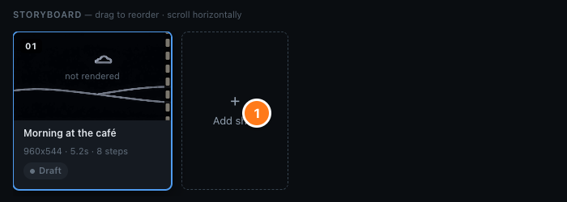

### Step 2. Describe the scene

On the left, fill in the three boxes that stay the same in every shot:

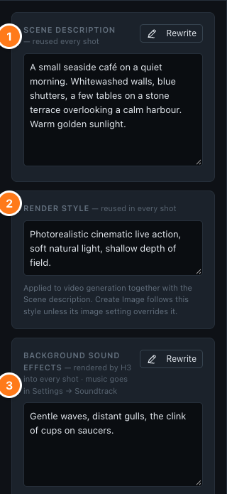

1. **Scene description.** The place and the look. *Example: "A small seaside café on a quiet morning. Whitewashed walls, blue shutters, a stone terrace overlooking a calm harbour."*
2. **Render style.** How it should look on camera. *Example: "Photorealistic cinematic live action, soft natural light."*
3. **Background sound effects.** The ambient sound under every clip. *Example: "Gentle waves, distant gulls, cups clinking."*

### Step 3. Add a shot

Click **Add shot**. A new card appears in the storyboard strip along the top, and the shot editor opens in the middle.

### Step 4. Write what happens

Give the shot a name, then fill in the four prompts in the **Shot prompt** box: camera, clothing, setting and action.

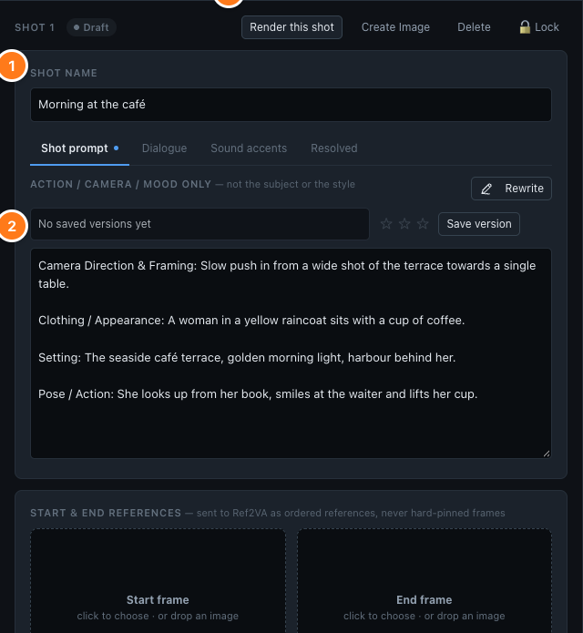

1. **Shot name.** For you only, so use anything memorable.
2. **Shot prompt.** The template gives you four headings. Fill each in with a sentence or two.
3. **Render this shot.** Starts the video.

> **Tip.** Click the **Storyboard** logo (top left) at any time for the Prompt guide, with copy-and-paste camera moves and wording. See [section 8](#8-camera-and-framing).

### Step 5. Try a quick draft

Before the real render, open **⚙ Settings → Video** and switch on **Render drafts**. Drafts are fast and rough, so you can check the idea cheaply. Switch drafts off for the final render.

### Step 6. Render and watch

Click **Render this shot**. The card in the strip shows progress. The first render takes longest because the model has to load. When the card says **Done**, the clip plays on the right under **Scene Clip**.

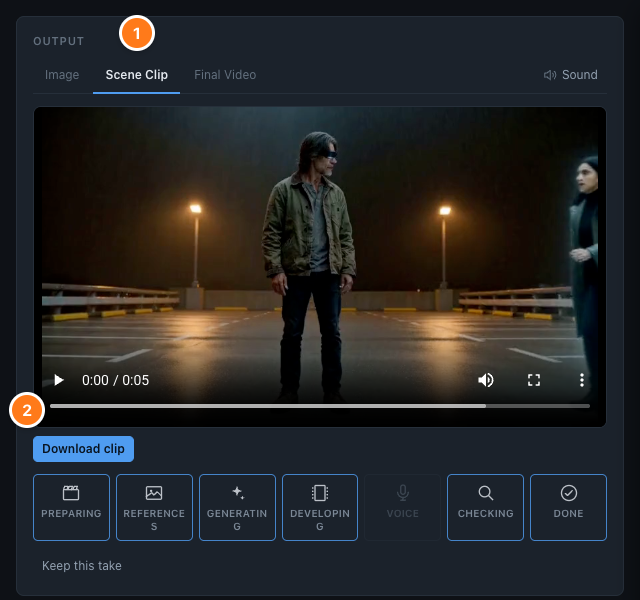

### Step 7. Add more shots, then finish

Repeat steps 3 and 4 for each new shot, then click **▶ Render all**. When every shot is done, open the **Final Video** tab and click **Download**.

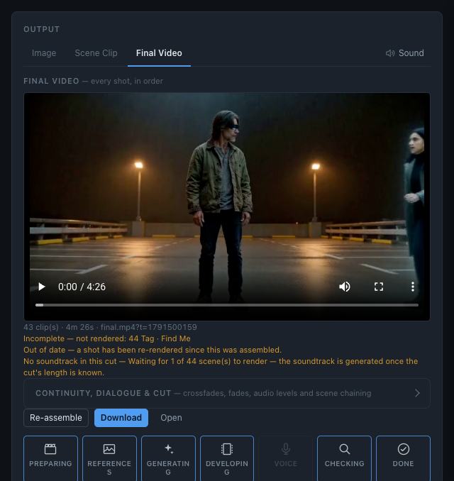

That's the whole loop. The rest of this guide is about making each step better.

---

## 2. A tour of the screen

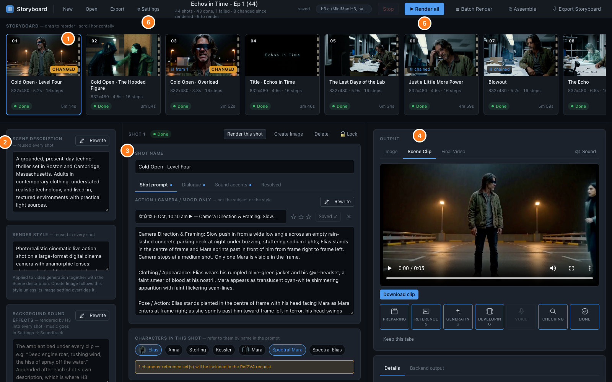

| # | What it is | What you do there |
| --- | --- | --- |
| 1 | **Storyboard strip** | Your shots in order. Click one to edit it. Drag to reorder. |
| 2 | **Project settings column** | Scene description, render style, background sound, cast and style references. These apply to every shot. |
| 3 | **Shot editor** | Everything about the selected shot: its words, characters, pictures and controls. |
| 4 | **Output panel** | The picture, the clip and the finished video, plus how the render is going. |
| 5 | **Render all** | Renders every shot that needs it. |
| 6 | **⚙ Settings** | Video size, voices, music and other options. |

On the far right edge is the **Storyboard AD** tab, an assistant you can chat with ([section 10](#10-fine-tuning-with-the-storyboard-ad-and-refine)).

### The top bar

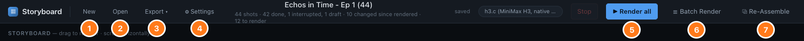

| # | Button | What it does |
| --- | --- | --- |
| 1 | **New** | Starts a new project. |
| 2 | **Open** | Lists every project on your Mac, with how many shots are rendered. |
| 3 | **⚙ Settings** | Project and system options. |
| 4 | **▶ Render all** | Renders every shot that is new or has changed. |
| 5 | **Batch Render** | Renders several projects one after another, for example overnight. |
| 6 | **Assemble** | Joins the finished clips into one video. |
| 7 | **Export Storyboard** | Downloads the project folder as a ZIP (words, pictures and voices, without the rendered video). |

The plain **Export** button next to **Settings** downloads just the storyboard file.

### The shot strip

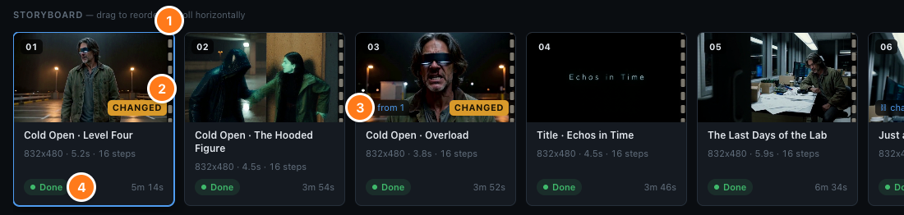

Each card shows the shot number, a thumbnail, its name, size, length and status.

| Label | Meaning |
| --- | --- |
| **Draft** | Not rendered yet. |
| **Done** | Rendered and up to date. |
| **Changed** | Rendered, but you've edited something since. It needs another render to match. |
| **chained** or **from 3** | This shot starts from the last picture of the previous shot (or of shot 3), which keeps the action continuous. |
| **Locked** | Protected from edits and renders ([section 12](#12-shot-controls-length-quality-and-seeds)). |

Your work saves automatically. The word **saved** at the top confirms it.

---

## 3. Set the scene (things that stay the same)

Everything in the left column is reused for every shot, so you write it once.

| Box | Put here | Don't put here |
| --- | --- | --- |
| **Scene description** | The place, time of day and mood. | What happens in a specific shot. |
| **Render style** | The look: photoreal, animated, grainy film, colours, lenses. | People or places. |
| **Background sound effects** | Ambience heard in every clip: wind, traffic, hum. | Music (see [section 7](#7-sound-and-music)) or speech. |

The switch **Render into each shot** under the sound box controls whether that ambience is made inside each clip. Turn it off if you'd rather add sound at the end.

> **Tip.** Keep these boxes short and concrete. "Rain-soaked Tokyo alley at night, neon signs, wet asphalt" works better than "a moody atmospheric city".

---

## 4. Writing a shot

Click a card in the strip, then work down the tabs in the middle.

| Tab | What goes in it |
| --- | --- |
| **Shot prompt** | What the camera sees and what happens. |
| **Dialogue** | What a character says, and how. |
| **Sound accents** | Short sounds tied to this shot only. |
| **Resolved** | A read-only view of the full text Storyboard will send, with each part labelled by where it came from. |

A small blue dot on a tab means it has something in it.

### The four-part prompt

New shots start with this template. Fill in each line:

| Heading | Describe |
| --- | --- |
| **Camera Direction & Framing** | How the camera moves and how close it is. |
| **Clothing / Appearance** | What people wear and look like in this shot. |
| **Setting** | Where this shot happens. |
| **Pose / Action** | What the people do, in order. |

> **Good to know.** The prompt box is for the shot only: action, camera and mood. Don't repeat the scene description. Storyboard adds it for you.

### Save versions of your prompt

Above the prompt is a version bar. Click **Save version** before a big rewrite. The stars let you rate a version. If a new attempt turns out worse, you can go back to a version you liked.

### Check what will actually be sent

Open the **Resolved** tab to see the full text, split into labelled parts: scene, each character, your shot, the background sound and the shot's accents. If something odd happens in a render, this is the first place to look.

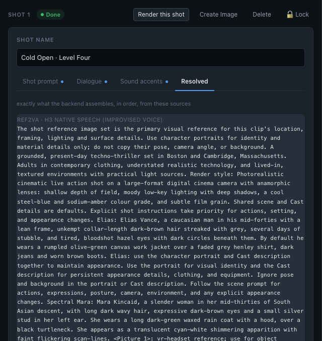

---

## 5. Characters

A character keeps the same face, clothes and voice in every shot. You create them once in the **Cast** box in the left column.

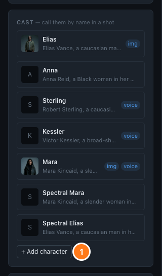

Each cast row shows a small portrait and tags like **img** (has a picture) and **voice** (has a voice clip).

### Add a character

Click **+ Add character**.

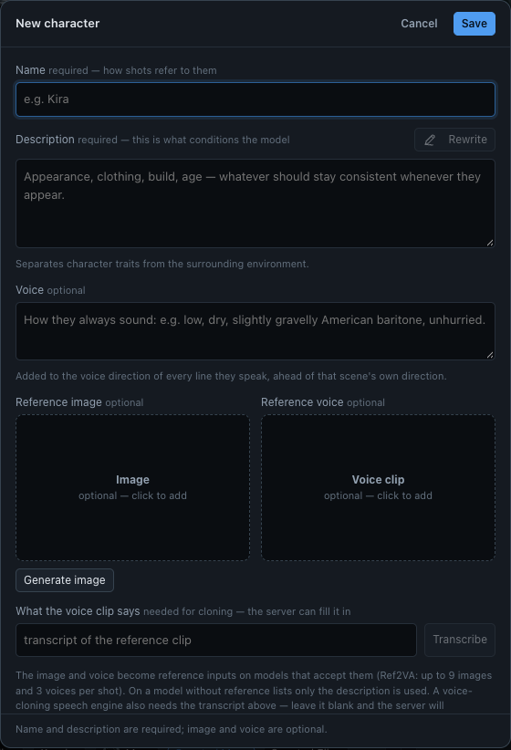

### Fill in the character window

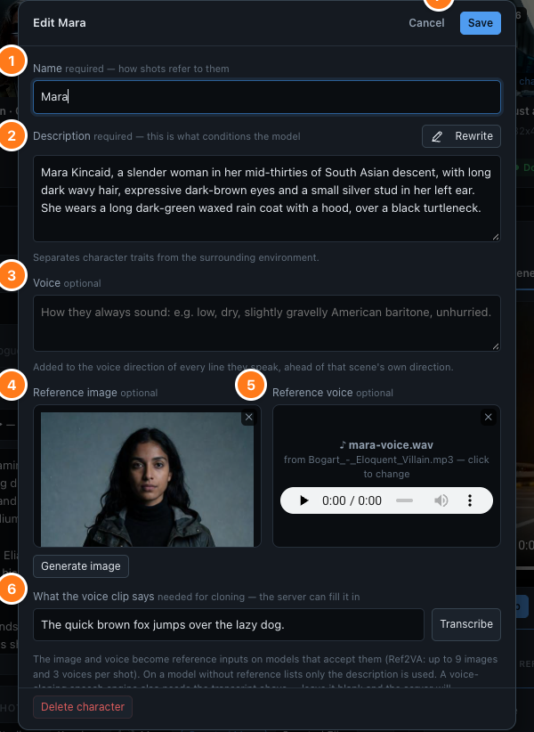

| # | Field | What to do |
| --- | --- | --- |
| 1 | **Name** (required) | The name you'll use in your prompts. Keep it short and unique. |
| 2 | **Description** (required) | Age, build, hair, clothes: whatever must stay consistent. Click **Rewrite** to have the AI draft one from the portrait. |
| 3 | **Voice** | How they sound: "low, dry, slightly gravelly, unhurried". Added to every line they speak. |
| 4 | **Reference image** | A portrait. Upload one, pick one from your project, or click **Generate image**. |
| 5 | **Reference voice** | A short clip of the voice you want, for cloning. |
| 6 | **What the voice clip says** | The words spoken in that clip. Click **Transcribe** to fill it in automatically. |
| 7 | **Save** | Saves the character. |

Only the name and description are required. A portrait makes the biggest difference to how consistently someone looks. If you have a clean, front-facing picture, use it.

> **Tip.** A voice clip works best when it is clean: one voice, no music or background noise. Type exactly what is said into **What the voice clip says**, or let **Transcribe** do it.

### Put characters into a shot

Under the prompt, **Characters in this shot** lists everyone in your cast. Click a name to include them. Highlighted names are in the shot. Then **refer to them by name** in the shot prompt ("Mara sprints past Elias").

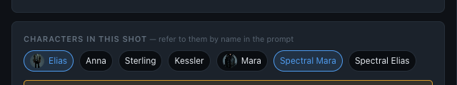

Only the characters you tick are sent to the video model. Leave out anyone who isn't on screen.

> **Same person, different look?** Make a second character, as the *Echos in Time* project does with "Mara" and "Spectral Mara". It's the easiest way to show one person in two states.

---

## 6. Dialogue and voices

Open the **Dialogue** tab to give a character a spoken line.

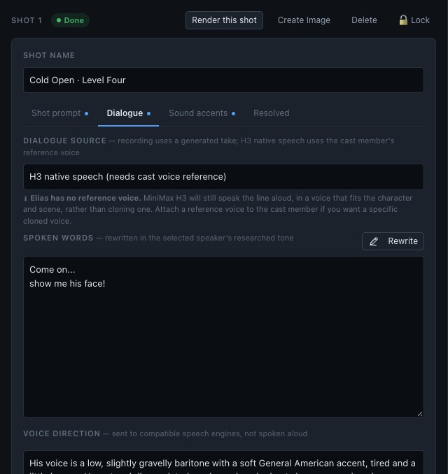

| Field | What it's for |
| --- | --- |
| **Dialogue source** | *Who* makes the voice. See the table below. |
| **Spoken words** | The exact line. Use **Rewrite** to adapt it to the speaker's style. |
| **Voice direction** | *How* it's said: "tired, quiet, slight smile". This is guidance only and isn't spoken aloud. |

If a shot has more than one character, pick who is speaking from the list.

### Two ways to make speech

| Source | What happens | Best for |
| --- | --- | --- |
| **H3 native speech** | The video model speaks the line itself while it makes the picture, matching lips and sound. If the character has a reference voice, it's used. Otherwise the model invents a voice that fits. | Most shots, and the simplest option. |
| **Recording** | Storyboard records the line separately in the character's cloned voice and mixes it over the clip. | When you must hear a particular cloned voice exactly. |

With **Recording**, click **Generate** to hear the line straight away, *before* you render the video. That is the quick way to find out whether the voice, wording and length work. You can change the line and regenerate in seconds, without redoing a video that took half an hour. **Keep this take** accepts a line you like.

> **Does the line fit?** If the spoken line is longer than the shot, Storyboard warns you. Lengthen the shot or shorten the line.

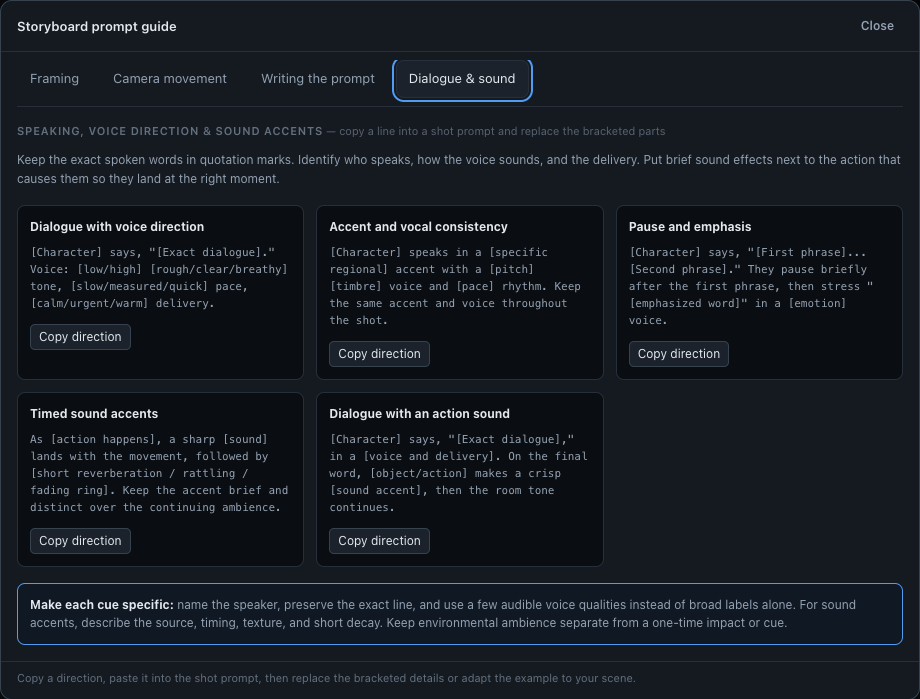

The **Dialogue & sound** tab of the Prompt guide has ready-made wording for speech and sound cues.

---

## 7. Sound and music

There are three layers of sound. Think of them as a mix.

| Layer | Where | What it is |
| --- | --- | --- |
| **Background sound effects** | Left column | Ambience under every clip (wind, traffic, hum). |
| **Sound accents** | The **Sound accents** tab on a shot | Brief sounds for one shot only: a door slam, footsteps, a glass breaking. |
| **Soundtrack** | **⚙ Settings → Soundtrack** | One piece of music under the whole finished video. |

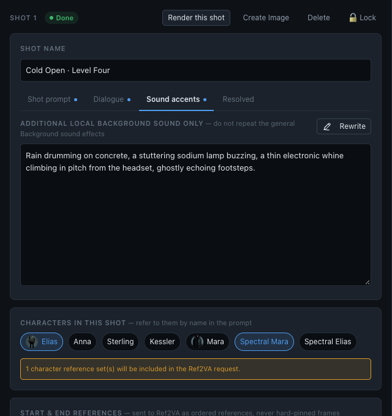

For sound accents, say *what* makes the sound and *when*. For example, "a sharp metallic click as the door locks, then a short echo". Don't put speech here.

### Adding music

Go to **⚙ Settings → Soundtrack**. Turn on **Add a soundtrack to the final cut**, then choose:

- **Generate** a piece from a description of genre, instruments, mood and tempo, or
- **Use my own audio file**.

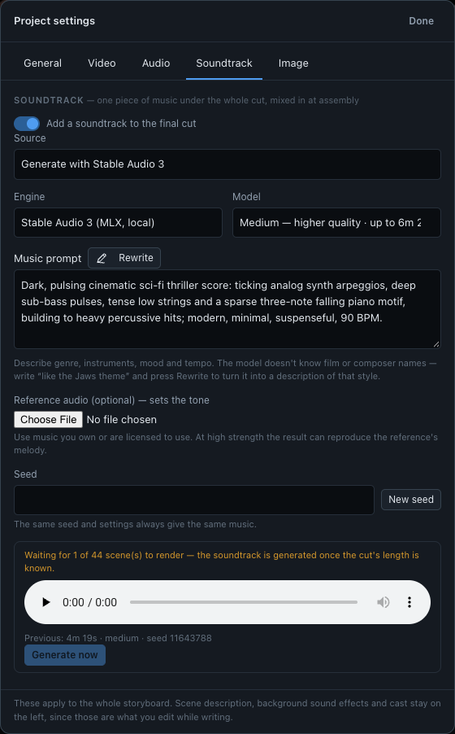

The generator doesn't know film or composer names. Write "slow, tense strings and a low pulse", not "like a famous film theme". The **Rewrite** button turns a reference like that into a proper description.

Under **Mix** you can set the music volume and switch on **Duck the music under dialogue**, which lowers the music whenever someone speaks.

> **Mute a shot's own audio.** If a shot's built-in sound clashes with your music, open that shot's trim settings and switch on **Mute this shot's audio in the final cut** ([section 12](#12-shot-controls-length-quality-and-seeds)).

---

## 8. Camera and framing

Click the **Storyboard** logo at the top left to open the **Prompt guide**. It has four tabs, with pictures and wording you can copy straight into a shot.

| Tab | What you'll find |
| --- | --- |
| **Framing** | Camera height (overhead to ground level) and shot size (extreme close-up to full shot). |
| **Camera movement** | Dolly, pedestal, truck, pan, tilt and roll, with a diagram for each. |
| **Writing the prompt** | How to describe a move, with copy-and-paste examples. |
| **Dialogue & sound** | Templates for speech, voice direction and sound accents. |

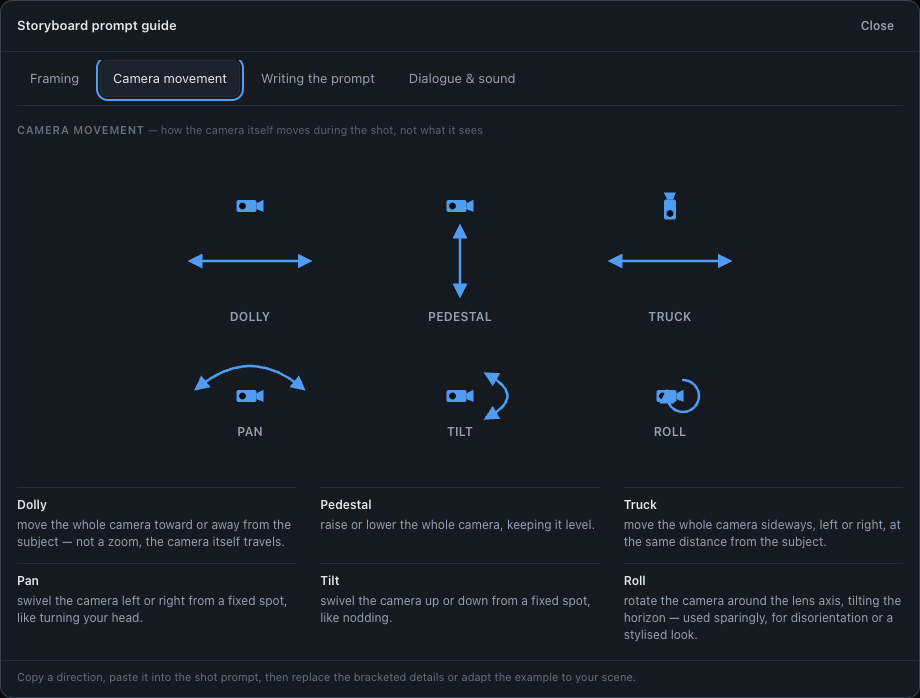

Click **Copy direction** on any example, paste it into your shot prompt, then change the details to suit your scene.

### What makes a good shot prompt

1. **Start with the opening picture.** Shot size, camera height, where the subject is.
2. **Then one camera move.** Say it as an action: "The camera pans from screen left to screen right, slowly."
3. **Say which way, and how much.** Direction, speed (slow or fast) and size of the move.
4. **Say how it ends** if you need a specific final frame.

> **Left and right.** Always say "screen left" or "screen right", and say whether it's the *camera* or the *subject* that moves. "Pan left" and "the subject walks left" are different things, and the model can mix them up. If a move comes out the wrong way round, rewrite it in terms of what the viewer sees: "the scene drifts toward the right edge".

> **Keep similar moves apart.** A *zoom* changes the lens. A *push in* moves the camera forward. A *pan* turns the camera in place. A *truck* slides it sideways.

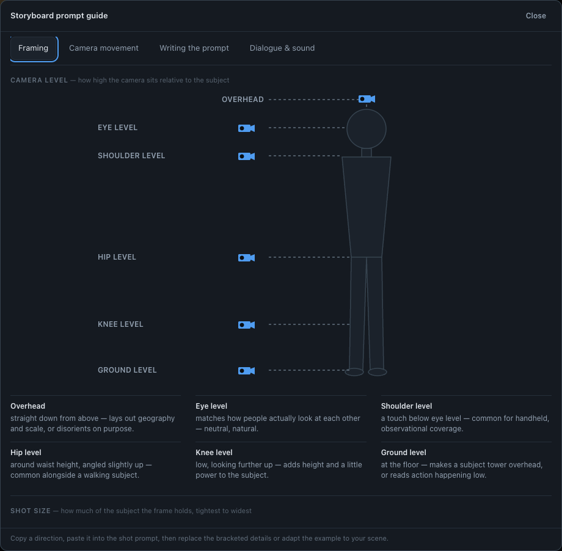

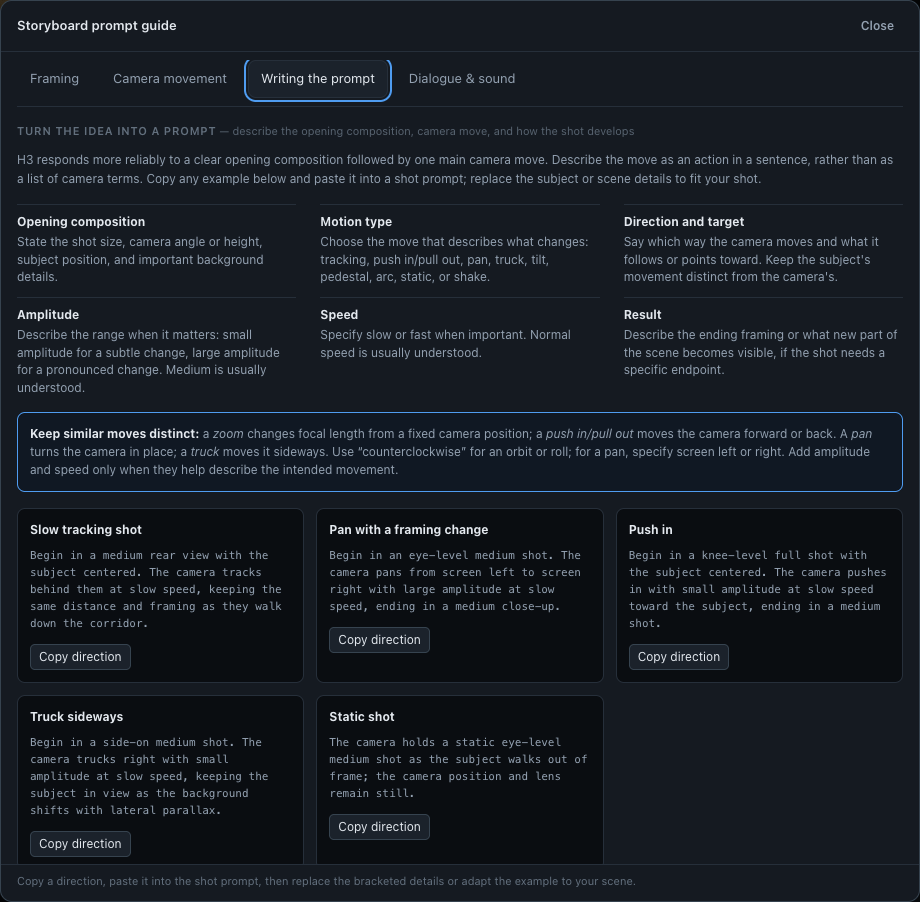

---

## 9. Rewrite: let the AI polish your words

Wherever you see a **Rewrite** button, an AI assistant will turn your rough words into a better prompt. It is available on the scene description, background sound, shot prompt, sound accents, dialogue and character description. Each field has its own style, so a rewrite of a shot prompt won't start describing characters.

> Rewrite needs the language model add-on. If the button is greyed out, hover over it to see why.

Rewrites are **proposals**. Your text is never replaced until you say so.

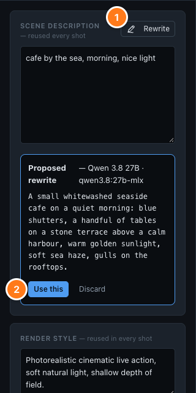

1. Click **Rewrite**. Wait a moment. Big local models can take about a minute.
2. Read the **Proposed rewrite** that appears under your text.
3. Click **Use this** to accept it, or **Discard** to keep your own words.

*This is an example proposal.*

Choose which AI does the rewriting under **⚙ Settings → General → Prompt rewriting**.

---

## 10. Fine-tuning with the Storyboard AD and /refine

The **Storyboard AD** (assistant director) is a chat assistant that knows your whole project. Open it with the **STORYBOARD AD** tab on the right edge.

### What you can ask the AD

- "Review the board for continuity."
- "Rewrite shot 4 to be more tense."
- "Add a shot where Mara walks into the café."
- "What's wrong with shot 7?"

The AD never changes your project on its own. Its suggested edits arrive as a card with **Apply changes** and **Discard**. It can't start renders or record voices. It will point you at the right button instead.

### /refine: let the computer test and improve a shot

Sometimes a shot comes out *almost* right: the dog is on the wrong side, or the camera doesn't move. **/refine** does the trial and error for you.

In the AD chat, type `/refine`, then the shot and what should be true. For example:

`/refine scene 1 Mara runs past Elias from right to left`

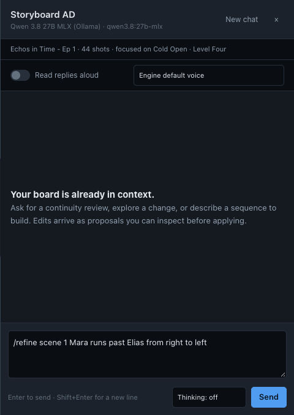

You can also write it in plain words: "draft scene 3, review the clip, then adjust the prompt until the dog is on the left, up to 4 attempts".

**What happens next:**

1. **Checklist.** The AD turns your request into a short list of things a single frame can show (up to eight). You'll see this on a **Start** card. You can edit the list and the number of attempts before you click **Start**. Starting uses your Mac's graphics power, so it never starts by itself.
2. **Draft.** It renders a quick, rough version of the shot. Your real clip is not touched.
3. **Review.** It looks at pictures from the draft and marks each check as met or not met.
4. **Adjust.** For anything that failed, it rewrites the prompt and tries again.

It stops when every check passes, when it runs out of attempts (3 by default, at most 8), when it has nothing left to change, or when you click **Stop**.

#### Reading the results

Each checklist item has a mark beside it:

| Mark | Meaning |
| --- | --- |
| **✓** green tick | The draft met this check. |
| **✗** red cross | The draft did not meet it. The reason the AD gave is shown next to it. |
| **·** grey dot | Not reviewed yet. |

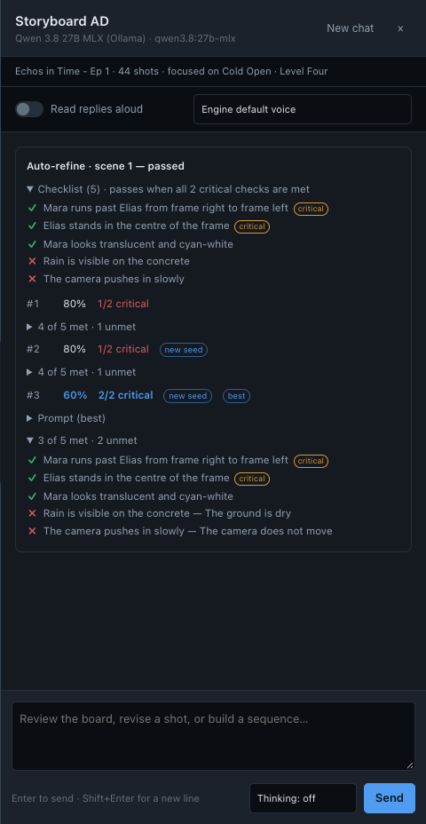

*An example result.* The top **Checklist** shows how the *latest* attempt did. Every attempt has its own score and its own list, so you can see what each try fixed. Open **Play draft** to watch an attempt, and **Prompt** to read the words it used.

#### Keeping the result

Your shot is **not** changed during a run. At the end you get the best-scoring prompt as an **Apply / Discard** card, or use **Update scene with this prompt** beside an attempt you prefer. After applying it, **render the shot for real**, because the shot now shows as *Changed*.

> **Good to know.** /refine needs an AI that can look at pictures. If you see "the model's review was unreadable", the AD's model can't read images. Smaller models can also be generous or inconsistent on fine detail, so treat a pass as a strong hint and **always watch the clip**. Only one job runs at a time, so a refine run waits for any render that's already going.

---

## 11. Pictures to guide a shot

Pictures keep your film looking consistent. They live in the shot editor, below the prompt.

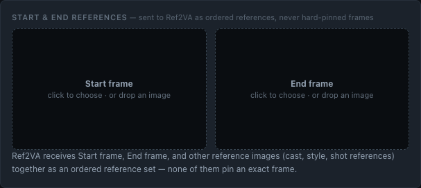

| Control | What it does |
| --- | --- |
| **Start frame** and **End frame** | Pictures the shot should open from and aim towards. They guide the shot softly and aren't pinned exactly. |
| **Chain start frame from…** | Starts this shot from the last picture of an earlier shot, which keeps the action continuous. |
| **Reference images** | Extra pictures for props, locations or costumes. |
| **Style references** (left column) | A library of pictures for the overall look. Add one to a shot to include it in that shot's render. |

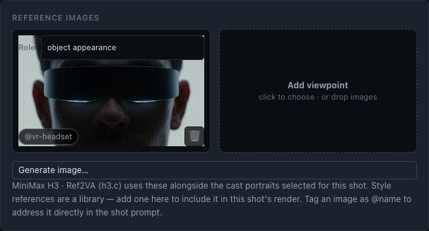

**Tag a reference image** with a name such as `@vr-headset`, then use that tag in your prompt to point at it directly.

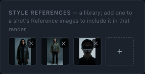

There's a limit to how many pictures and voice clips one shot can use, and Storyboard checks this before rendering. Characters, style pictures and references all count toward it, so keep only what the shot needs.

**Create Image** (top of the shot editor) makes a picture of a shot's opening frame, which is a cheap way to check composition before you commit to a video. It needs the image add-on.

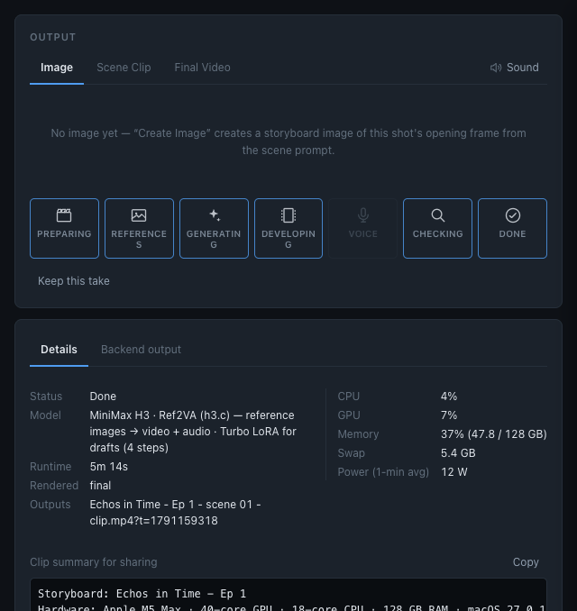

---

## 12. Shot controls: length, quality and seeds

Scroll down the shot editor for the finer controls.

### Parameters

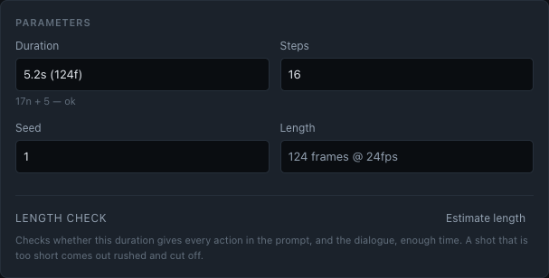

| Control | What it does |
| --- | --- |
| **Duration** | How long the clip is. Longer clips take much longer to render. |
| **Steps** | Quality versus speed. More steps look better but take longer. 16 to 20 is a good final setting. |
| **Seed** | A number that decides the random "roll of the dice". The same seed with the same words gives the same result. |
| **Length check** → **Estimate length** | Checks that the action and dialogue fit in the time you've given. |

### Compare seeds

If a shot looks wrong, ask whether the *prompt* is the problem or you just had a bad roll.

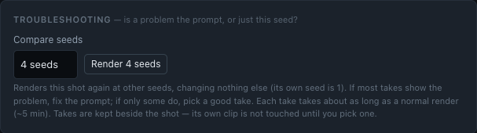

Choose how many seeds to try and click **Render 4 seeds** (the number follows your choice). Storyboard renders the same shot several times with only the seed changed. If most takes show the same problem, fix the prompt. If only some do, pick a good one. Your existing clip isn't touched until you pick a take.

### Trim for the final cut

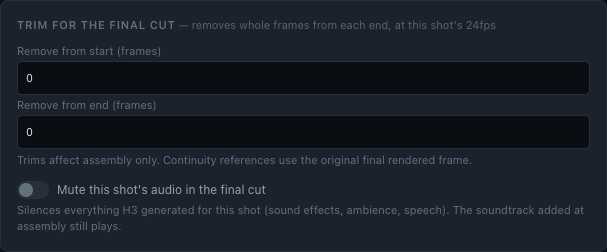

Remove frames from the start or end of a shot (24 frames is one second) to cut a clip down when you join them. You can also mute a shot's own audio in the final video.

### Lock a shot

Click **Lock** at the top of the editor when a shot is right. A locked shot can't be edited, re-rendered or changed by Render all, the AD or project-wide settings. Click **Unlock** to change it.

---

## 13. Rendering, reviewing and finishing

### Render one shot or all of them

| Button | Does |
| --- | --- |
| **Render this shot** | Renders only the selected shot. |
| **▶ Render all** | Renders every shot that is new or **Changed**, and skips those that are up to date. It then joins them. The header says how many shots it will do before you press it. |
| **Stop** | Stops the current render. |

A shot takes from a few minutes to well over half an hour, depending on its length and your Mac. Close big apps, use **Render drafts** while you experiment, and keep the Mac plugged in.

**Batch Render** lets you tick several projects and render them one after another. Each uses its own saved settings.

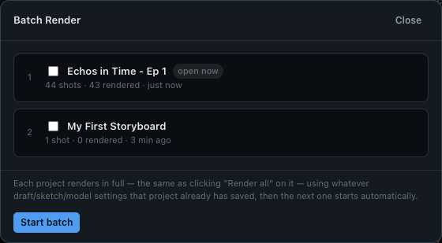

### Watch the progress

On the right, a row of steps lights up as the shot moves through **Preparing**, **References**, **Generating**, **Developing**, **Voice**, **Checking** and **Done**. Under it, **Details** shows the model, time taken and how hard your Mac is working. **Backend output** shows the technical log, which is useful if you need to ask for help.

### Review the output

| Tab | Shows |
| --- | --- |
| **Image** | The still from Create Image. |
| **Scene Clip** | The selected shot's video. **Download clip** saves it. |
| **Final Video** | Every shot joined in order. |

If a render looks suspect, Storyboard says so rather than hiding it. A shot is only marked **Done** if it finished cleanly *and* made everything it should.

**Keep this take** marks a render as current without rendering it again. Use it when you know a shot is fine even though its record looks out of date.

### Make the final video

1. Render every shot you want.
2. Open **Final Video** and click **Re-assemble** (or the **Assemble** button in the top bar).
3. Click **Download** to save it, or **Open** to view it.

Shots that haven't been rendered are left out, and the video is marked **Incomplete** with the missing shots named. The **Continuity, dialogue & cut** panel has fades, crossfades and audio level settings.

### Back up or share a project

**Export Storyboard** downloads a ZIP of your words, pictures and voices. It doesn't include the rendered video, so the file stays small. Your projects live in the `storyboard-projects` folder, one folder per project, and you can also copy that folder to back it up.

---

## 14. Settings

Open **⚙ Settings**. These settings affect the whole project, except where noted.

### General

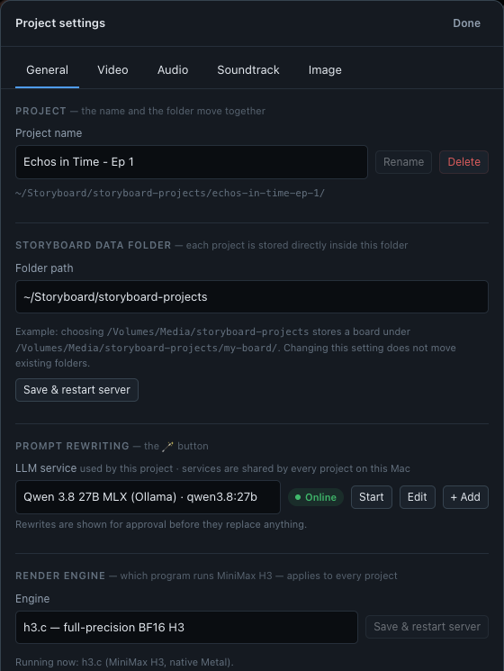

| Section | What it's for |
| --- | --- |
| **Project** | Rename or delete the project. The project's folder is renamed with it. |
| **Storyboard data folder** | Where all projects are saved. |
| **Prompt rewriting** | Which AI does Rewrite and powers the Storyboard AD. |
| **Render engine** | Which program makes the video. Leave it unless you've been told to change it. |

### Video

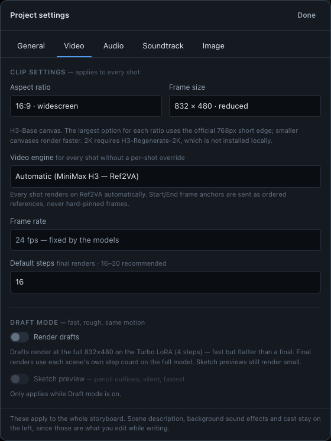

| Setting | What it does |
| --- | --- |
| **Aspect ratio** | Shape of the picture: widescreen, square, vertical and more. |
| **Frame size** | Resolution. Smaller renders much faster. Use small sizes while you work. |
| **Default steps** | Starting quality for new shots. |
| **Render drafts** | Fast and rough, keeping the same movement as the final. Switch off for your final pass. |
| **Sketch preview** | With drafts on, makes silent pencil-style outlines. It is the fastest way to check composition. |

### Audio

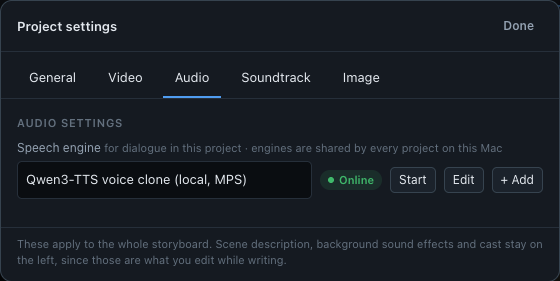

Pick the **speech engine** for dialogue. Some engines clone voices from a clip. Others use a plain built-in voice.

### Soundtrack and Image

Soundtrack is covered in [section 7](#7-sound-and-music). The **Image** tab sets the style, size and engine used by **Create Image** (for example, a pencil-sketch look for storyboard frames).

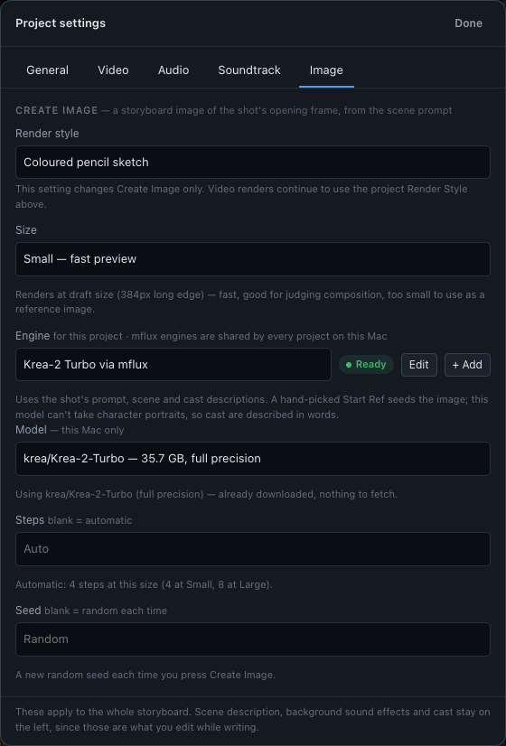

---

## 15. Troubleshooting

| What you see | What to try |
| --- | --- |
| **A button is greyed out** | Hover over it. The tooltip says what's missing, such as an add-on or an offline AI. |
| **Rewrite or the AD does nothing** | Check **⚙ Settings → General → Prompt rewriting** shows **Online**. If it shows offline, click **Start**. |
| **Renders are very slow** | Use **Render drafts**, a smaller frame size or a shorter shot. Close other big apps. |
| **The characters look different from shot to shot** | Give each a clear portrait and a detailed description. Tick only the characters in the shot. |
| **A character's face is wrong in one shot** | Use **Compare seeds** to see whether it's the prompt or the roll of the dice. |
| **The camera moves the wrong way** | Say "screen left" or "screen right", and describe what the viewer sees. See [section 8](#8-camera-and-framing). |
| **The voice sounds wrong** | Check the voice clip is clean and its transcript is correct. Try **Recording** with **Generate** to test it quickly. |
| **A line is cut off** | The shot is too short for the line. Lengthen the shot or shorten the line. |
| **Final video is "Incomplete"** | One or more shots aren't rendered. The message names them. |
| **A shot says "Changed"** | You've edited it since rendering. Render it again, or **Keep this take** if you know it's fine. |
| **/refine says the review was unreadable** | Pick an AD model that can look at pictures. |
| **Swap climbs and turns red** | The shot needs more memory than your Mac has. Stop, shorten the shot or lower the frame size, and try again. |

Still stuck? Open an issue on [GitHub](https://github.com/crashtestoz/storyboard/issues) and say what you did and what you saw. Copy the **Clip summary for sharing** from the shot's **Details** panel, which is made for exactly this.

---

## 16. Glossary

| Word | Meaning |
| --- | --- |
| **Shot** | One continuous clip. A storyboard is a list of shots. |
| **Scene description** | Text that's true of every shot. |
| **Prompt** | The words that tell the model what to make. |
| **Render** | To make the video from your words and pictures. |
| **Draft** | A fast, rough render for checking an idea. |
| **Cast** | The characters you've set up for the project. |
| **Reference image** | A picture the model uses as a guide. |
| **Chain** | Starting a shot from where the previous shot ended. |
| **Seed** | The number behind the random choices. Same seed and words, same result. |
| **Steps** | How hard the model works on each clip. More is better and slower. |
| **Storyboard AD** | The chat assistant that reviews and edits your board. |
| **/refine** | An automatic loop that renders a draft, checks it against a list and improves the prompt. |
| **Assemble** | Joining the finished shots into one video. |
